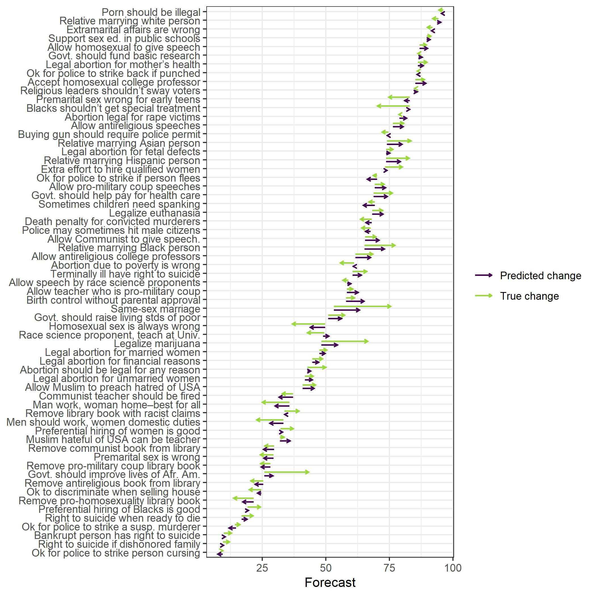

## 2.1 Measuring the argument advantage of a moral opinion


```
## [1] 27
```

```
## # A tibble: 1 x 4
##   `min(n)` `max(n)` `mean(n)` `sum(n)`
##      <int>    <int>     <dbl>    <int>
## 1       98      110      104.     2805
```

```
## # A tibble: 1 x 3
##   `mean(age)` `sd(age)` `mean(sex == "Female", na.rm = TRUE)`
##         <dbl>     <dbl>                                 <dbl>
## 1        36.0      12.5                                 0.592
```

```
## # A tibble: 3 x 3
##   polviews     n `n/sum(n)`
##   <fct>    <int>      <dbl>
## 1 (-1,3]    1421      0.507
## 2 (3,6]      909      0.324
## 3 (6,10]     475      0.169
```

```
## # A tibble: 10 x 2
##        n    nn
##    <int> <int>
##  1     1   154
##  2     2   239
##  3     3   257
##  4     4   141
##  5     5   130
##  6     6    12
##  7     7     9
##  8     8     2
##  9     9     3
## 10    10     1
```

```
## # A tibble: 1 x 4
##   `n_distinct(id)` `mean(age)` `sd(age)` `mean(sex == "Female", na.rm = TRUE)`
##              <int>       <dbl>     <dbl>                                 <dbl>
## 1              945        36.3      12.6                                 0.586
```

## 2.2 Forecasting shifts of public opinion on moral issues


<div class="figure" style="text-align: center">

<p class="caption">Figure 1. Public opinion change generated by models with a constant positive effect of argument advantage, with (solid) or without (dashed) random error terms. Parameter values: c_i = 0.03, e_i,t N(0, 0.14)</p>
</div>

## 2.3 Assessment of the forecasting models using existing data


```
## # A tibble: 1 x 1
##   n_issues
##      <int>
## 1       63
```


<table class=" lightable-classic" style='font-family: "Arial Narrow", "Source Sans Pro", sans-serif; margin-left: auto; margin-right: auto;'>
<caption>Table 1. 2018 point forecast accuracy: mean absolute error in percentage points for different prediction methods and forecasting time spans.</caption>
 <thead>
  <tr>
   <th style="text-align:left;"> Time span of forecast </th>
   <th style="text-align:left;"> Benchmark </th>
   <th style="text-align:left;"> Trends </th>
   <th style="text-align:right;"> AA </th>
   <th style="text-align:left;"> Ratio AA: benchmark </th>
  </tr>
 </thead>
<tbody>
  <tr>
   <td style="text-align:left;"> 8 years </td>
   <td style="text-align:left;"> 5.1 </td>
   <td style="text-align:left;"> 4.0 </td>
   <td style="text-align:right;"> 3.2 </td>
   <td style="text-align:left;"> 63% </td>
  </tr>
  <tr>
   <td style="text-align:left;"> 6 years </td>
   <td style="text-align:left;"> 5.0 </td>
   <td style="text-align:left;"> 3.6 </td>
   <td style="text-align:right;"> 3.4 </td>
   <td style="text-align:left;"> 68% </td>
  </tr>
  <tr>
   <td style="text-align:left;"> 4 years </td>
   <td style="text-align:left;"> 3.4 </td>
   <td style="text-align:left;"> 2.9 </td>
   <td style="text-align:right;"> 2.7 </td>
   <td style="text-align:left;"> 79% </td>
  </tr>
  <tr>
   <td style="text-align:left;"> 2 years </td>
   <td style="text-align:left;"> 2.2 </td>
   <td style="text-align:left;"> 2.0 </td>
   <td style="text-align:right;"> 1.9 </td>
   <td style="text-align:left;"> 86% </td>
  </tr>
</tbody>
</table>
# 3. Predictions

<div class="figure" style="text-align: center">

<p class="caption">Figure 2. The change from 2010 to 2018 in the popularity of 60 moral opinions in the United States estimated from GSS polls (green arrows) and predicted from argument advantage measures (black arrows). The opinions are labeled by the corresponding variables in the GSS dataset.</p>
</div>

<table class=" lightable-classic" style='font-family: "Arial Narrow", "Source Sans Pro", sans-serif; margin-left: auto; margin-right: auto;'>
 <thead>
  <tr>
   <th style="text-align:left;"> Item </th>
   <th style="text-align:left;"> GSS code </th>
   <th style="text-align:right;"> AA </th>
   <th style="text-align:left;"> Latest public opinion </th>
   <th style="text-align:left;"> Forecast 2020 </th>
   <th style="text-align:left;"> Forecast 2022 </th>
   <th style="text-align:left;"> Forecast 2024 </th>
   <th style="text-align:left;"> Forecast 2026 </th>
   <th style="text-align:left;"> Forecast 2028 </th>
   <th style="text-align:left;"> Forecast 2030 </th>
  </tr>
 </thead>
<tbody>
  <tr>
   <td style="text-align:left;"> Homosexual couples should have the right to marry one another. </td>
   <td style="text-align:left;"> marhomo </td>
   <td style="text-align:right;"> 0.41 </td>
   <td style="text-align:left;"> 0.75 (2018) </td>
   <td style="text-align:left;"> 0.77 </td>
   <td style="text-align:left;"> 0.79 </td>
   <td style="text-align:left;"> 0.80 </td>
   <td style="text-align:left;"> 0.82 </td>
   <td style="text-align:left;"> 0.83 </td>
   <td style="text-align:left;"> 0.85 </td>
  </tr>
  <tr>
   <td style="text-align:left;"> Would you be in favor of having a close relative or family member marry a black person? </td>
   <td style="text-align:left;"> marblk </td>
   <td style="text-align:right;"> 0.36 </td>
   <td style="text-align:left;"> 0.77 (2018) </td>
   <td style="text-align:left;"> 0.79 </td>
   <td style="text-align:left;"> 0.80 </td>
   <td style="text-align:left;"> 0.81 </td>
   <td style="text-align:left;"> 0.83 </td>
   <td style="text-align:left;"> 0.84 </td>
   <td style="text-align:left;"> 0.85 </td>
  </tr>
  <tr>
   <td style="text-align:left;"> Consider a man who admits that he is a homosexual. Should such a person be allowed to teach in a college or university? </td>
   <td style="text-align:left;"> colhomo </td>
   <td style="text-align:right;"> 0.35 </td>
   <td style="text-align:left;"> 0.89 (2018) </td>
   <td style="text-align:left;"> 0.90 </td>
   <td style="text-align:left;"> 0.90 </td>
   <td style="text-align:left;"> 0.91 </td>
   <td style="text-align:left;"> 0.92 </td>
   <td style="text-align:left;"> 0.92 </td>
   <td style="text-align:left;"> 0.93 </td>
  </tr>
  <tr>
   <td style="text-align:left;"> Would you be in favor of having a close relative or family member marry an Asian American person? </td>
   <td style="text-align:left;"> marasian </td>
   <td style="text-align:right;"> 0.32 </td>
   <td style="text-align:left;"> 0.83 (2018) </td>
   <td style="text-align:left;"> 0.84 </td>
   <td style="text-align:left;"> 0.85 </td>
   <td style="text-align:left;"> 0.86 </td>
   <td style="text-align:left;"> 0.87 </td>
   <td style="text-align:left;"> 0.88 </td>
   <td style="text-align:left;"> 0.89 </td>
  </tr>
  <tr>
   <td style="text-align:left;"> Would you be in favor of having a close relative or family member marry a Hispanic American person? </td>
   <td style="text-align:left;"> marhisp </td>
   <td style="text-align:right;"> 0.29 </td>
   <td style="text-align:left;"> 0.83 (2018) </td>
   <td style="text-align:left;"> 0.84 </td>
   <td style="text-align:left;"> 0.85 </td>
   <td style="text-align:left;"> 0.86 </td>
   <td style="text-align:left;"> 0.86 </td>
   <td style="text-align:left;"> 0.87 </td>
   <td style="text-align:left;"> 0.88 </td>
  </tr>
  <tr>
   <td style="text-align:left;"> Consider a man who admits that he is a homosexual? Suppose this admitted homosexual wanted to make a speech in your community. Should he be allowed to speak? </td>
   <td style="text-align:left;"> spkhomo </td>
   <td style="text-align:right;"> 0.29 </td>
   <td style="text-align:left;"> 0.90 (2018) </td>
   <td style="text-align:left;"> 0.90 </td>
   <td style="text-align:left;"> 0.91 </td>
   <td style="text-align:left;"> 0.91 </td>
   <td style="text-align:left;"> 0.92 </td>
   <td style="text-align:left;"> 0.92 </td>
   <td style="text-align:left;"> 0.93 </td>
  </tr>
  <tr>
   <td style="text-align:left;"> Do you agree that methods of birth control should be available to teenagers between the ages of 14 and 16 if their parents do not approve? </td>
   <td style="text-align:left;"> pillok </td>
   <td style="text-align:right;"> 0.28 </td>
   <td style="text-align:left;"> 0.61 (2018) </td>
   <td style="text-align:left;"> 0.63 </td>
   <td style="text-align:left;"> 0.64 </td>
   <td style="text-align:left;"> 0.66 </td>
   <td style="text-align:left;"> 0.68 </td>
   <td style="text-align:left;"> 0.69 </td>
   <td style="text-align:left;"> 0.71 </td>
  </tr>
  <tr>
   <td style="text-align:left;"> There are many ways people or organisations can protest against a government action they strongly oppose. Do you think organising public meetings to protest against the government should be allowed?* </td>
   <td style="text-align:left;"> protest1 </td>
   <td style="text-align:right;"> 0.25 </td>
   <td style="text-align:left;"> 0.82 (2016) </td>
   <td style="text-align:left;"> 0.84 </td>
   <td style="text-align:left;"> 0.85 </td>
   <td style="text-align:left;"> 0.85 </td>
   <td style="text-align:left;"> 0.86 </td>
   <td style="text-align:left;"> 0.87 </td>
   <td style="text-align:left;"> 0.88 </td>
  </tr>
  <tr>
   <td style="text-align:left;"> In general some people think that it is the responsibility of the government in Washington to see to it that people have help in paying for doctors and hospital bills. Others think that these matters are not the responsibility of the federal government and that people should take care of these things themselves. Do you think that it is the responsibility of the government? </td>
   <td style="text-align:left;"> helpsick </td>
   <td style="text-align:right;"> 0.24 </td>
   <td style="text-align:left;"> 0.76 (2018) </td>
   <td style="text-align:left;"> 0.77 </td>
   <td style="text-align:left;"> 0.78 </td>
   <td style="text-align:left;"> 0.79 </td>
   <td style="text-align:left;"> 0.80 </td>
   <td style="text-align:left;"> 0.81 </td>
   <td style="text-align:left;"> 0.82 </td>
  </tr>
  <tr>
   <td style="text-align:left;"> There are many ways people or organisations can protest against a government action they strongly oppose. Do you think people should be allowed to organize protest marches and demonstrations against the government?* </td>
   <td style="text-align:left;"> protest3 </td>
   <td style="text-align:right;"> 0.24 </td>
   <td style="text-align:left;"> 0.83 (2016) </td>
   <td style="text-align:left;"> 0.84 </td>
   <td style="text-align:left;"> 0.85 </td>
   <td style="text-align:left;"> 0.86 </td>
   <td style="text-align:left;"> 0.87 </td>
   <td style="text-align:left;"> 0.87 </td>
   <td style="text-align:left;"> 0.88 </td>
  </tr>
  <tr>
   <td style="text-align:left;"> There are always some people whose ideas are considered bad or dangerous by other people. For instance: somebody who is against all churches and religion -- should such a person be allowed to teach in a college or university? </td>
   <td style="text-align:left;"> colath </td>
   <td style="text-align:right;"> 0.24 </td>
   <td style="text-align:left;"> 0.68 (2018) </td>
   <td style="text-align:left;"> 0.70 </td>
   <td style="text-align:left;"> 0.71 </td>
   <td style="text-align:left;"> 0.72 </td>
   <td style="text-align:left;"> 0.73 </td>
   <td style="text-align:left;"> 0.75 </td>
   <td style="text-align:left;"> 0.76 </td>
  </tr>
  <tr>
   <td style="text-align:left;"> Do you think the use of marijuana should be made legal? </td>
   <td style="text-align:left;"> grass </td>
   <td style="text-align:right;"> 0.23 </td>
   <td style="text-align:left;"> 0.66 (2018) </td>
   <td style="text-align:left;"> 0.68 </td>
   <td style="text-align:left;"> 0.69 </td>
   <td style="text-align:left;"> 0.70 </td>
   <td style="text-align:left;"> 0.71 </td>
   <td style="text-align:left;"> 0.73 </td>
   <td style="text-align:left;"> 0.74 </td>
  </tr>
  <tr>
   <td style="text-align:left;"> Consider a man who admits he is a Communist. Suppose this admitted Communist wanted to make a speech in your community. Should he be allowed to speak? </td>
   <td style="text-align:left;"> spkcom </td>
   <td style="text-align:right;"> 0.23 </td>
   <td style="text-align:left;"> 0.70 (2018) </td>
   <td style="text-align:left;"> 0.71 </td>
   <td style="text-align:left;"> 0.72 </td>
   <td style="text-align:left;"> 0.73 </td>
   <td style="text-align:left;"> 0.74 </td>
   <td style="text-align:left;"> 0.75 </td>
   <td style="text-align:left;"> 0.76 </td>
  </tr>
  <tr>
   <td style="text-align:left;"> It is alright for a couple to live together without intending to get married.* </td>
   <td style="text-align:left;"> cohabok </td>
   <td style="text-align:right;"> 0.21 </td>
   <td style="text-align:left;"> 0.66 (2012) </td>
   <td style="text-align:left;"> 0.70 </td>
   <td style="text-align:left;"> 0.71 </td>
   <td style="text-align:left;"> 0.72 </td>
   <td style="text-align:left;"> 0.74 </td>
   <td style="text-align:left;"> 0.75 </td>
   <td style="text-align:left;"> 0.76 </td>
  </tr>
  <tr>
   <td style="text-align:left;"> Would you be in favor of having a close relative or family member marry a white person? </td>
   <td style="text-align:left;"> marwht </td>
   <td style="text-align:right;"> 0.21 </td>
   <td style="text-align:left;"> 0.92 (2018) </td>
   <td style="text-align:left;"> 0.92 </td>
   <td style="text-align:left;"> 0.93 </td>
   <td style="text-align:left;"> 0.93 </td>
   <td style="text-align:left;"> 0.93 </td>
   <td style="text-align:left;"> 0.94 </td>
   <td style="text-align:left;"> 0.94 </td>
  </tr>
  <tr>
   <td style="text-align:left;"> Consider somebody who is against all churches and religion. If such a person wanted to make a speech in your (city/town/community) against churches and religion -- should he be allowed to speak? </td>
   <td style="text-align:left;"> spkath </td>
   <td style="text-align:right;"> 0.21 </td>
   <td style="text-align:left;"> 0.81 (2018) </td>
   <td style="text-align:left;"> 0.81 </td>
   <td style="text-align:left;"> 0.82 </td>
   <td style="text-align:left;"> 0.83 </td>
   <td style="text-align:left;"> 0.84 </td>
   <td style="text-align:left;"> 0.84 </td>
   <td style="text-align:left;"> 0.85 </td>
  </tr>
  <tr>
   <td style="text-align:left;"> People have different religions and different religious views. Would you accept a person from a different religion or with a very different religious view from yours marrying a relative of yours?* </td>
   <td style="text-align:left;"> relmarry </td>
   <td style="text-align:right;"> 0.20 </td>
   <td style="text-align:left;"> 0.91 (2018) </td>
   <td style="text-align:left;"> 0.92 </td>
   <td style="text-align:left;"> 0.92 </td>
   <td style="text-align:left;"> 0.92 </td>
   <td style="text-align:left;"> 0.93 </td>
   <td style="text-align:left;"> 0.93 </td>
   <td style="text-align:left;"> 0.93 </td>
  </tr>
  <tr>
   <td style="text-align:left;"> There are different opinions about immigrants from other countries living in America. (By “immigrants” we mean people who come to settle in America). Do you agree that legal immigrants who are not citizens should have the same rights as American citizens?* </td>
   <td style="text-align:left;"> immrghts </td>
   <td style="text-align:right;"> 0.19 </td>
   <td style="text-align:left;"> 0.43 (2014) </td>
   <td style="text-align:left;"> 0.47 </td>
   <td style="text-align:left;"> 0.48 </td>
   <td style="text-align:left;"> 0.49 </td>
   <td style="text-align:left;"> 0.51 </td>
   <td style="text-align:left;"> 0.52 </td>
   <td style="text-align:left;"> 0.53 </td>
  </tr>
  <tr>
   <td style="text-align:left;"> Some people think that the government in Washington should do everything possible to improve the standard of living of all poor Americans. Other people think it is not the government's responsibility and that each person should take care of himself. Do you think that the government should do everything possible to improve the standard of living of all poor Americans? </td>
   <td style="text-align:left;"> helppoor </td>
   <td style="text-align:right;"> 0.18 </td>
   <td style="text-align:left;"> 0.57 (2018) </td>
   <td style="text-align:left;"> 0.59 </td>
   <td style="text-align:left;"> 0.60 </td>
   <td style="text-align:left;"> 0.61 </td>
   <td style="text-align:left;"> 0.62 </td>
   <td style="text-align:left;"> 0.63 </td>
   <td style="text-align:left;"> 0.64 </td>
  </tr>
  <tr>
   <td style="text-align:left;"> Consider a person who advocates doing away with elections and letting the military run the country. If such a person wanted to make a speech in your community -- should he be allowed to speak? </td>
   <td style="text-align:left;"> spkmil </td>
   <td style="text-align:right;"> 0.17 </td>
   <td style="text-align:left;"> 0.73 (2018) </td>
   <td style="text-align:left;"> 0.74 </td>
   <td style="text-align:left;"> 0.75 </td>
   <td style="text-align:left;"> 0.76 </td>
   <td style="text-align:left;"> 0.76 </td>
   <td style="text-align:left;"> 0.77 </td>
   <td style="text-align:left;"> 0.78 </td>
  </tr>
  <tr>
   <td style="text-align:left;"> When a person has a disease that cannot be cured -- do you think doctors should be allowed by law to end the patient's life by some painless means if the patient and his family request it? </td>
   <td style="text-align:left;"> letdie1 </td>
   <td style="text-align:right;"> 0.17 </td>
   <td style="text-align:left;"> 0.72 (2018) </td>
   <td style="text-align:left;"> 0.73 </td>
   <td style="text-align:left;"> 0.74 </td>
   <td style="text-align:left;"> 0.75 </td>
   <td style="text-align:left;"> 0.76 </td>
   <td style="text-align:left;"> 0.77 </td>
   <td style="text-align:left;"> 0.77 </td>
  </tr>
  <tr>
   <td style="text-align:left;"> Consider a person who advocates doing away with elections and letting the military run the country. Should such a person be allowed to teach in a college or university? </td>
   <td style="text-align:left;"> colmil </td>
   <td style="text-align:right;"> 0.16 </td>
   <td style="text-align:left;"> 0.61 (2018) </td>
   <td style="text-align:left;"> 0.62 </td>
   <td style="text-align:left;"> 0.63 </td>
   <td style="text-align:left;"> 0.64 </td>
   <td style="text-align:left;"> 0.64 </td>
   <td style="text-align:left;"> 0.65 </td>
   <td style="text-align:left;"> 0.66 </td>
  </tr>
  <tr>
   <td style="text-align:left;"> Do you think it should be possible for a pregnant woman to obtain a legal abortion if the woman's own health is seriously endangered by the pregnancy? </td>
   <td style="text-align:left;"> abhlth </td>
   <td style="text-align:right;"> 0.16 </td>
   <td style="text-align:left;"> 0.90 (2018) </td>
   <td style="text-align:left;"> 0.90 </td>
   <td style="text-align:left;"> 0.91 </td>
   <td style="text-align:left;"> 0.91 </td>
   <td style="text-align:left;"> 0.91 </td>
   <td style="text-align:left;"> 0.92 </td>
   <td style="text-align:left;"> 0.92 </td>
  </tr>
  <tr>
   <td style="text-align:left;"> All systems of justice make mistakes, but which do you think is worse: to convict an innocent person or to let a guilty person go free? Do you think that to convict an innocent person is worse?* </td>
   <td style="text-align:left;"> verdict </td>
   <td style="text-align:right;"> 0.15 </td>
   <td style="text-align:left;"> 0.78 (2016) </td>
   <td style="text-align:left;"> 0.80 </td>
   <td style="text-align:left;"> 0.81 </td>
   <td style="text-align:left;"> 0.81 </td>
   <td style="text-align:left;"> 0.82 </td>
   <td style="text-align:left;"> 0.82 </td>
   <td style="text-align:left;"> 0.83 </td>
  </tr>
  <tr>
   <td style="text-align:left;"> Now consider a Muslim clergyman who preaches hatred of the United States. If such a person wanted to make a speech in your community preaching hatred of the United States - should he be allowed to speak? </td>
   <td style="text-align:left;"> spkmslm </td>
   <td style="text-align:right;"> 0.15 </td>
   <td style="text-align:left;"> 0.46 (2018) </td>
   <td style="text-align:left;"> 0.47 </td>
   <td style="text-align:left;"> 0.48 </td>
   <td style="text-align:left;"> 0.49 </td>
   <td style="text-align:left;"> 0.50 </td>
   <td style="text-align:left;"> 0.51 </td>
   <td style="text-align:left;"> 0.52 </td>
  </tr>
  <tr>
   <td style="text-align:left;"> Ethnic minorities should be given government assistance to preserve their customs and traditions. </td>
   <td style="text-align:left;"> mincult </td>
   <td style="text-align:right;"> 0.14 </td>
   <td style="text-align:left;"> 0.22 (2014) </td>
   <td style="text-align:left;"> 0.24 </td>
   <td style="text-align:left;"> 0.24 </td>
   <td style="text-align:left;"> 0.25 </td>
   <td style="text-align:left;"> 0.26 </td>
   <td style="text-align:left;"> 0.27 </td>
   <td style="text-align:left;"> 0.28 </td>
  </tr>
  <tr>
   <td style="text-align:left;"> Do you think it should be possible for a pregnant woman to obtain a legal abortion if she became pregnant as a result of rape? </td>
   <td style="text-align:left;"> abrape </td>
   <td style="text-align:right;"> 0.14 </td>
   <td style="text-align:left;"> 0.79 (2018) </td>
   <td style="text-align:left;"> 0.79 </td>
   <td style="text-align:left;"> 0.80 </td>
   <td style="text-align:left;"> 0.81 </td>
   <td style="text-align:left;"> 0.81 </td>
   <td style="text-align:left;"> 0.82 </td>
   <td style="text-align:left;"> 0.82 </td>
  </tr>
  <tr>
   <td style="text-align:left;"> Now consider a Muslim clergyman who preaches hatred of the United States. Should such a person be allowed to teach in a college or university? </td>
   <td style="text-align:left;"> colmslm </td>
   <td style="text-align:right;"> 0.14 </td>
   <td style="text-align:left;"> 0.34 (2018) </td>
   <td style="text-align:left;"> 0.34 </td>
   <td style="text-align:left;"> 0.35 </td>
   <td style="text-align:left;"> 0.36 </td>
   <td style="text-align:left;"> 0.37 </td>
   <td style="text-align:left;"> 0.38 </td>
   <td style="text-align:left;"> 0.39 </td>
  </tr>
  <tr>
   <td style="text-align:left;"> Some people think that African-Americans have been discriminated against for so long that the government has a special obligation to help improve their living standards. Others believe that the government should not be giving special treatment to African-Americans. Do you think that the government should help improve the living standards of African-Americans? </td>
   <td style="text-align:left;"> helpblk </td>
   <td style="text-align:right;"> 0.13 </td>
   <td style="text-align:left;"> 0.43 (2018) </td>
   <td style="text-align:left;"> 0.44 </td>
   <td style="text-align:left;"> 0.45 </td>
   <td style="text-align:left;"> 0.46 </td>
   <td style="text-align:left;"> 0.47 </td>
   <td style="text-align:left;"> 0.48 </td>
   <td style="text-align:left;"> 0.49 </td>
  </tr>
  <tr>
   <td style="text-align:left;"> Should people who want to overthrow the government by force be allowed to hold public meetings?* </td>
   <td style="text-align:left;"> revmeet </td>
   <td style="text-align:right;"> 0.12 </td>
   <td style="text-align:left;"> 0.35 (2014) </td>
   <td style="text-align:left;"> 0.38 </td>
   <td style="text-align:left;"> 0.38 </td>
   <td style="text-align:left;"> 0.39 </td>
   <td style="text-align:left;"> 0.40 </td>
   <td style="text-align:left;"> 0.41 </td>
   <td style="text-align:left;"> 0.42 </td>
  </tr>
  <tr>
   <td style="text-align:left;"> Some people say that it is better for a country if different racial and ethnic groups maintain their distinct customs and traditions. Others say that it is better if these groups adapt and blend into the larger society. Do you agree that it is better for a country if different racial and ethnic groups maintain their distinct customs and traditions?* </td>
   <td style="text-align:left;"> meltpot1 </td>
   <td style="text-align:right;"> 0.12 </td>
   <td style="text-align:left;"> 0.45 (2014) </td>
   <td style="text-align:left;"> 0.47 </td>
   <td style="text-align:left;"> 0.48 </td>
   <td style="text-align:left;"> 0.49 </td>
   <td style="text-align:left;"> 0.50 </td>
   <td style="text-align:left;"> 0.51 </td>
   <td style="text-align:left;"> 0.52 </td>
  </tr>
  <tr>
   <td style="text-align:left;"> Consider a couple who both work full-time and now have a new born child. They are both in a similar work situation and are eligible for paid leave. Some people think the mother and the father should each take half of the paid leave period. Others think that the mother should take the most if not entire paid leave period. Do you think the mother and the father should each take half of the paid leave period?* </td>
   <td style="text-align:left;"> paidlvdv </td>
   <td style="text-align:right;"> 0.11 </td>
   <td style="text-align:left;"> 0.36 (2012) </td>
   <td style="text-align:left;"> 0.39 </td>
   <td style="text-align:left;"> 0.40 </td>
   <td style="text-align:left;"> 0.41 </td>
   <td style="text-align:left;"> 0.42 </td>
   <td style="text-align:left;"> 0.43 </td>
   <td style="text-align:left;"> 0.43 </td>
  </tr>
  <tr>
   <td style="text-align:left;"> Do you think a person has the right to end his or her own life if this person has an incurable disease? </td>
   <td style="text-align:left;"> suicide1 </td>
   <td style="text-align:right;"> 0.11 </td>
   <td style="text-align:left;"> 0.66 (2018) </td>
   <td style="text-align:left;"> 0.67 </td>
   <td style="text-align:left;"> 0.67 </td>
   <td style="text-align:left;"> 0.68 </td>
   <td style="text-align:left;"> 0.69 </td>
   <td style="text-align:left;"> 0.70 </td>
   <td style="text-align:left;"> 0.70 </td>
  </tr>
  <tr>
   <td style="text-align:left;"> Would you be for sex education in the public schools? </td>
   <td style="text-align:left;"> sexeduc </td>
   <td style="text-align:right;"> 0.11 </td>
   <td style="text-align:left;"> 0.91 (2018) </td>
   <td style="text-align:left;"> 0.92 </td>
   <td style="text-align:left;"> 0.92 </td>
   <td style="text-align:left;"> 0.92 </td>
   <td style="text-align:left;"> 0.92 </td>
   <td style="text-align:left;"> 0.92 </td>
   <td style="text-align:left;"> 0.93 </td>
  </tr>
  <tr>
   <td style="text-align:left;"> There are some people whose views are considered extreme by the majority. Consider people who want to overthrow the government by revolution. Do you think such people should be allowed to hold public meetings to express their views?* </td>
   <td style="text-align:left;"> revspeak </td>
   <td style="text-align:right;"> 0.11 </td>
   <td style="text-align:left;"> 0.77 (2016) </td>
   <td style="text-align:left;"> 0.78 </td>
   <td style="text-align:left;"> 0.78 </td>
   <td style="text-align:left;"> 0.79 </td>
   <td style="text-align:left;"> 0.79 </td>
   <td style="text-align:left;"> 0.80 </td>
   <td style="text-align:left;"> 0.80 </td>
  </tr>
  <tr>
   <td style="text-align:left;"> Do you think a person has the right to end his or her own life if this person is tired of living and ready to die? </td>
   <td style="text-align:left;"> suicide4 </td>
   <td style="text-align:right;"> 0.10 </td>
   <td style="text-align:left;"> 0.21 (2018) </td>
   <td style="text-align:left;"> 0.22 </td>
   <td style="text-align:left;"> 0.22 </td>
   <td style="text-align:left;"> 0.23 </td>
   <td style="text-align:left;"> 0.23 </td>
   <td style="text-align:left;"> 0.24 </td>
   <td style="text-align:left;"> 0.24 </td>
  </tr>
  <tr>
   <td style="text-align:left;"> People should be willing to help others who are less fortunate. </td>
   <td style="text-align:left;"> othshelp </td>
   <td style="text-align:right;"> 0.08 </td>
   <td style="text-align:left;"> 0.98 (2014) </td>
   <td style="text-align:left;"> 0.98 </td>
   <td style="text-align:left;"> 0.98 </td>
   <td style="text-align:left;"> 0.98 </td>
   <td style="text-align:left;"> 0.98 </td>
   <td style="text-align:left;"> 0.98 </td>
   <td style="text-align:left;"> 0.98 </td>
  </tr>
  <tr>
   <td style="text-align:left;"> Do you think it should be possible for a pregnant woman to obtain a legal abortion if she is not married and does not want to marry the man? </td>
   <td style="text-align:left;"> absingle </td>
   <td style="text-align:right;"> 0.08 </td>
   <td style="text-align:left;"> 0.45 (2018) </td>
   <td style="text-align:left;"> 0.46 </td>
   <td style="text-align:left;"> 0.46 </td>
   <td style="text-align:left;"> 0.47 </td>
   <td style="text-align:left;"> 0.47 </td>
   <td style="text-align:left;"> 0.48 </td>
   <td style="text-align:left;"> 0.49 </td>
  </tr>
  <tr>
   <td style="text-align:left;"> There are some people whose views are considered extreme by the majority. Consider people who want to overthrow the government by revolution. Do you think such people should be allowed to publish books expressing their views?* </td>
   <td style="text-align:left;"> revpub </td>
   <td style="text-align:right;"> 0.07 </td>
   <td style="text-align:left;"> 0.84 (2016) </td>
   <td style="text-align:left;"> 0.85 </td>
   <td style="text-align:left;"> 0.85 </td>
   <td style="text-align:left;"> 0.85 </td>
   <td style="text-align:left;"> 0.86 </td>
   <td style="text-align:left;"> 0.86 </td>
   <td style="text-align:left;"> 0.86 </td>
  </tr>
  <tr>
   <td style="text-align:left;"> Even if it brings no immediate benefits - scientific research that advances the frontiers of knowledge is necessary and should be supported by the federal government. </td>
   <td style="text-align:left;"> advfront </td>
   <td style="text-align:right;"> 0.07 </td>
   <td style="text-align:left;"> 0.86 (2018) </td>
   <td style="text-align:left;"> 0.86 </td>
   <td style="text-align:left;"> 0.87 </td>
   <td style="text-align:left;"> 0.87 </td>
   <td style="text-align:left;"> 0.87 </td>
   <td style="text-align:left;"> 0.87 </td>
   <td style="text-align:left;"> 0.88 </td>
  </tr>
  <tr>
   <td style="text-align:left;"> Do you think it should be possible for a pregnant woman to obtain a legal abortion if the family has a very low income and cannot afford any more children? </td>
   <td style="text-align:left;"> abpoor </td>
   <td style="text-align:right;"> 0.06 </td>
   <td style="text-align:left;"> 0.49 (2018) </td>
   <td style="text-align:left;"> 0.49 </td>
   <td style="text-align:left;"> 0.50 </td>
   <td style="text-align:left;"> 0.50 </td>
   <td style="text-align:left;"> 0.51 </td>
   <td style="text-align:left;"> 0.51 </td>
   <td style="text-align:left;"> 0.52 </td>
  </tr>
  <tr>
   <td style="text-align:left;"> Should religious extremists be allowed to hold public meetings?* </td>
   <td style="text-align:left;"> relmeet </td>
   <td style="text-align:right;"> 0.05 </td>
   <td style="text-align:left;"> 0.75 (2014) </td>
   <td style="text-align:left;"> 0.76 </td>
   <td style="text-align:left;"> 0.77 </td>
   <td style="text-align:left;"> 0.77 </td>
   <td style="text-align:left;"> 0.77 </td>
   <td style="text-align:left;"> 0.78 </td>
   <td style="text-align:left;"> 0.78 </td>
  </tr>
  <tr>
   <td style="text-align:left;"> Do you think it should be possible for a pregnant woman to obtain a legal abortion if she is married and does not want any more children? </td>
   <td style="text-align:left;"> abnomore </td>
   <td style="text-align:right;"> 0.05 </td>
   <td style="text-align:left;"> 0.50 (2018) </td>
   <td style="text-align:left;"> 0.51 </td>
   <td style="text-align:left;"> 0.51 </td>
   <td style="text-align:left;"> 0.52 </td>
   <td style="text-align:left;"> 0.52 </td>
   <td style="text-align:left;"> 0.53 </td>
   <td style="text-align:left;"> 0.53 </td>
  </tr>
  <tr>
   <td style="text-align:left;"> Consider a person who believes that Blacks are genetically inferior. Should such a person be allowed to teach in a college or university? </td>
   <td style="text-align:left;"> colrac </td>
   <td style="text-align:right;"> 0.05 </td>
   <td style="text-align:left;"> 0.43 (2018) </td>
   <td style="text-align:left;"> 0.43 </td>
   <td style="text-align:left;"> 0.44 </td>
   <td style="text-align:left;"> 0.44 </td>
   <td style="text-align:left;"> 0.44 </td>
   <td style="text-align:left;"> 0.45 </td>
   <td style="text-align:left;"> 0.45 </td>
  </tr>
  <tr>
   <td style="text-align:left;"> Religious leaders should not try to influence how people vote in elections. </td>
   <td style="text-align:left;"> clergvte </td>
   <td style="text-align:right;"> 0.04 </td>
   <td style="text-align:left;"> 0.85 (2018) </td>
   <td style="text-align:left;"> 0.85 </td>
   <td style="text-align:left;"> 0.85 </td>
   <td style="text-align:left;"> 0.86 </td>
   <td style="text-align:left;"> 0.86 </td>
   <td style="text-align:left;"> 0.86 </td>
   <td style="text-align:left;"> 0.86 </td>
  </tr>
  <tr>
   <td style="text-align:left;"> There are some people whose views are considered extreme by the majority. Consider religious extremists, that is people who believe that their religion is the only true faith and all other religions should be considered as enemies. Do you think such people should be allowed to hold public meetings to express their views?* </td>
   <td style="text-align:left;"> relext1 </td>
   <td style="text-align:right;"> 0.04 </td>
   <td style="text-align:left;"> 0.56 (2018) </td>
   <td style="text-align:left;"> 0.57 </td>
   <td style="text-align:left;"> 0.57 </td>
   <td style="text-align:left;"> 0.57 </td>
   <td style="text-align:left;"> 0.58 </td>
   <td style="text-align:left;"> 0.58 </td>
   <td style="text-align:left;"> 0.58 </td>
  </tr>
  <tr>
   <td style="text-align:left;"> People who are better off should help friends who are less well off.* </td>
   <td style="text-align:left;"> helpfrds </td>
   <td style="text-align:right;"> 0.03 </td>
   <td style="text-align:left;"> 0.87 (2018) </td>
   <td style="text-align:left;"> 0.87 </td>
   <td style="text-align:left;"> 0.87 </td>
   <td style="text-align:left;"> 0.87 </td>
   <td style="text-align:left;"> 0.87 </td>
   <td style="text-align:left;"> 0.87 </td>
   <td style="text-align:left;"> 0.88 </td>
  </tr>
  <tr>
   <td style="text-align:left;"> On the whole - do you think it should be the government's responsibility to impose strict laws to make industry do less damage to the environment? </td>
   <td style="text-align:left;"> grnlaws </td>
   <td style="text-align:right;"> 0.03 </td>
   <td style="text-align:left;"> 0.91 (2016) </td>
   <td style="text-align:left;"> 0.91 </td>
   <td style="text-align:left;"> 0.91 </td>
   <td style="text-align:left;"> 0.91 </td>
   <td style="text-align:left;"> 0.91 </td>
   <td style="text-align:left;"> 0.92 </td>
   <td style="text-align:left;"> 0.92 </td>
  </tr>
  <tr>
   <td style="text-align:left;"> Do you think it should be possible for a pregnant woman to obtain a legal abortion if there is a strong chance of serious defect in the baby? </td>
   <td style="text-align:left;"> abdefect </td>
   <td style="text-align:right;"> 0.03 </td>
   <td style="text-align:left;"> 0.76 (2018) </td>
   <td style="text-align:left;"> 0.77 </td>
   <td style="text-align:left;"> 0.77 </td>
   <td style="text-align:left;"> 0.77 </td>
   <td style="text-align:left;"> 0.77 </td>
   <td style="text-align:left;"> 0.78 </td>
   <td style="text-align:left;"> 0.78 </td>
  </tr>
  <tr>
   <td style="text-align:left;"> Both the husband and the wife should contribute to the household income. </td>
   <td style="text-align:left;"> twoincs </td>
   <td style="text-align:right;"> 0.02 </td>
   <td style="text-align:left;"> 0.86 (2012) </td>
   <td style="text-align:left;"> 0.87 </td>
   <td style="text-align:left;"> 0.87 </td>
   <td style="text-align:left;"> 0.87 </td>
   <td style="text-align:left;"> 0.87 </td>
   <td style="text-align:left;"> 0.87 </td>
   <td style="text-align:left;"> 0.87 </td>
  </tr>
  <tr>
   <td style="text-align:left;"> Consider a person who believes that Blacks are genetically inferior. If such a person wanted to make a speech in your community claiming that Blacks are inferior -- should he be allowed to speak? </td>
   <td style="text-align:left;"> spkrac </td>
   <td style="text-align:right;"> 0.01 </td>
   <td style="text-align:left;"> 0.57 (2018) </td>
   <td style="text-align:left;"> 0.57 </td>
   <td style="text-align:left;"> 0.57 </td>
   <td style="text-align:left;"> 0.58 </td>
   <td style="text-align:left;"> 0.58 </td>
   <td style="text-align:left;"> 0.58 </td>
   <td style="text-align:left;"> 0.58 </td>
  </tr>
  <tr>
   <td style="text-align:left;"> Suppose the government suspected that a terrorist act was about to happen. Do you think the authorities should have the right to tap people’s telephone conversations?* </td>
   <td style="text-align:left;"> tapphone </td>
   <td style="text-align:right;"> 0.01 </td>
   <td style="text-align:left;"> 0.51 (2016) </td>
   <td style="text-align:left;"> 0.52 </td>
   <td style="text-align:left;"> 0.52 </td>
   <td style="text-align:left;"> 0.52 </td>
   <td style="text-align:left;"> 0.53 </td>
   <td style="text-align:left;"> 0.53 </td>
   <td style="text-align:left;"> 0.53 </td>
  </tr>
  <tr>
   <td style="text-align:left;"> Do you think it should be possible for a pregnant woman to obtain a legal abortion if the woman wants it for any reason? </td>
   <td style="text-align:left;"> abany </td>
   <td style="text-align:right;"> 0.00 </td>
   <td style="text-align:left;"> 0.50 (2018) </td>
   <td style="text-align:left;"> 0.50 </td>
   <td style="text-align:left;"> 0.50 </td>
   <td style="text-align:left;"> 0.51 </td>
   <td style="text-align:left;"> 0.51 </td>
   <td style="text-align:left;"> 0.51 </td>
   <td style="text-align:left;"> 0.51 </td>
  </tr>
  <tr>
   <td style="text-align:left;"> Do you think a person has the right to end his or her own life if this person has gone bankrupt? </td>
   <td style="text-align:left;"> suicide2 </td>
   <td style="text-align:right;"> 0.00 </td>
   <td style="text-align:left;"> 0.13 (2018) </td>
   <td style="text-align:left;"> 0.13 </td>
   <td style="text-align:left;"> 0.13 </td>
   <td style="text-align:left;"> 0.13 </td>
   <td style="text-align:left;"> 0.13 </td>
   <td style="text-align:left;"> 0.13 </td>
   <td style="text-align:left;"> 0.13 </td>
  </tr>
  <tr>
   <td style="text-align:left;"> Because of past discrimination employers should make special efforts to hire and promote qualified women. </td>
   <td style="text-align:left;"> fehire </td>
   <td style="text-align:right;"> -0.01 </td>
   <td style="text-align:left;"> 0.80 (2018) </td>
   <td style="text-align:left;"> 0.80 </td>
   <td style="text-align:left;"> 0.80 </td>
   <td style="text-align:left;"> 0.80 </td>
   <td style="text-align:left;"> 0.80 </td>
   <td style="text-align:left;"> 0.81 </td>
   <td style="text-align:left;"> 0.81 </td>
  </tr>
  <tr>
   <td style="text-align:left;"> Some people say that because of past discrimination women should be given preference in hiring and promotion. Others say that such preference in hiring and promotion of women is wrong because it discriminates against men. What about your opinion - are you for preferential hiring and promotion of women? </td>
   <td style="text-align:left;"> fejobaff </td>
   <td style="text-align:right;"> -0.01 </td>
   <td style="text-align:left;"> 0.37 (2018) </td>
   <td style="text-align:left;"> 0.37 </td>
   <td style="text-align:left;"> 0.37 </td>
   <td style="text-align:left;"> 0.38 </td>
   <td style="text-align:left;"> 0.38 </td>
   <td style="text-align:left;"> 0.38 </td>
   <td style="text-align:left;"> 0.38 </td>
  </tr>
  <tr>
   <td style="text-align:left;"> Irish and Italians and Jewish and many other minorities overcame prejudice and worked their way up. Blacks should do the same without special favors. </td>
   <td style="text-align:left;"> wrkwayup </td>
   <td style="text-align:right;"> -0.02 </td>
   <td style="text-align:left;"> 0.70 (2018) </td>
   <td style="text-align:left;"> 0.70 </td>
   <td style="text-align:left;"> 0.70 </td>
   <td style="text-align:left;"> 0.70 </td>
   <td style="text-align:left;"> 0.71 </td>
   <td style="text-align:left;"> 0.71 </td>
   <td style="text-align:left;"> 0.71 </td>
  </tr>
  <tr>
   <td style="text-align:left;"> For certain problems - like environmental pollution - international bodies should have the right to enforce solutions. </td>
   <td style="text-align:left;"> wrldgovt </td>
   <td style="text-align:right;"> -0.02 </td>
   <td style="text-align:left;"> 0.77 (2014) </td>
   <td style="text-align:left;"> 0.77 </td>
   <td style="text-align:left;"> 0.77 </td>
   <td style="text-align:left;"> 0.77 </td>
   <td style="text-align:left;"> 0.77 </td>
   <td style="text-align:left;"> 0.77 </td>
   <td style="text-align:left;"> 0.77 </td>
  </tr>
  <tr>
   <td style="text-align:left;"> Some people say that because of past discrimination - blacks should be given preference in hiring and promotion. Others say that such preference in hiring and promotion of blacks is wrong because it discriminates against whites. What about your opinion - are you for preferential hiring and promotion of blacks? </td>
   <td style="text-align:left;"> affrmact </td>
   <td style="text-align:right;"> -0.04 </td>
   <td style="text-align:left;"> 0.24 (2018) </td>
   <td style="text-align:left;"> 0.24 </td>
   <td style="text-align:left;"> 0.24 </td>
   <td style="text-align:left;"> 0.24 </td>
   <td style="text-align:left;"> 0.24 </td>
   <td style="text-align:left;"> 0.24 </td>
   <td style="text-align:left;"> 0.24 </td>
  </tr>
  <tr>
   <td style="text-align:left;"> Adult children have a duty to look after their elderly parents.* </td>
   <td style="text-align:left;"> kidpars </td>
   <td style="text-align:right;"> -0.04 </td>
   <td style="text-align:left;"> 0.91 (2018) </td>
   <td style="text-align:left;"> 0.91 </td>
   <td style="text-align:left;"> 0.91 </td>
   <td style="text-align:left;"> 0.91 </td>
   <td style="text-align:left;"> 0.91 </td>
   <td style="text-align:left;"> 0.91 </td>
   <td style="text-align:left;"> 0.91 </td>
  </tr>
  <tr>
   <td style="text-align:left;"> Do you think a person has the right to end his or her own life if this person has dishonored his or her family? </td>
   <td style="text-align:left;"> suicide3 </td>
   <td style="text-align:right;"> -0.04 </td>
   <td style="text-align:left;"> 0.12 (2018) </td>
   <td style="text-align:left;"> 0.12 </td>
   <td style="text-align:left;"> 0.12 </td>
   <td style="text-align:left;"> 0.12 </td>
   <td style="text-align:left;"> 0.12 </td>
   <td style="text-align:left;"> 0.12 </td>
   <td style="text-align:left;"> 0.12 </td>
  </tr>
  <tr>
   <td style="text-align:left;"> Do you think that the American government should have the right to keep people under video surveillance in public areas?* </td>
   <td style="text-align:left;"> cctv </td>
   <td style="text-align:right;"> -0.04 </td>
   <td style="text-align:left;"> 0.65 (2016) </td>
   <td style="text-align:left;"> 0.65 </td>
   <td style="text-align:left;"> 0.65 </td>
   <td style="text-align:left;"> 0.65 </td>
   <td style="text-align:left;"> 0.65 </td>
   <td style="text-align:left;"> 0.65 </td>
   <td style="text-align:left;"> 0.65 </td>
  </tr>
  <tr>
   <td style="text-align:left;"> Do you personally think it is wrong for a woman to have an abortion if the family has a very low income and cannot afford any more children. </td>
   <td style="text-align:left;"> abpoorw </td>
   <td style="text-align:right;"> -0.04 </td>
   <td style="text-align:left;"> 0.56 (2018) </td>
   <td style="text-align:left;"> 0.56 </td>
   <td style="text-align:left;"> 0.56 </td>
   <td style="text-align:left;"> 0.56 </td>
   <td style="text-align:left;"> 0.56 </td>
   <td style="text-align:left;"> 0.55 </td>
   <td style="text-align:left;"> 0.55 </td>
  </tr>
  <tr>
   <td style="text-align:left;"> Consider a person who believes that Blacks are genetically inferior. If some people in your community suggested that a book he wrote which said Blacks are inferior should be taken out of your public library -- would you favor removing this book? </td>
   <td style="text-align:left;"> librac </td>
   <td style="text-align:right;"> -0.05 </td>
   <td style="text-align:left;"> 0.39 (2018) </td>
   <td style="text-align:left;"> 0.39 </td>
   <td style="text-align:left;"> 0.39 </td>
   <td style="text-align:left;"> 0.39 </td>
   <td style="text-align:left;"> 0.39 </td>
   <td style="text-align:left;"> 0.39 </td>
   <td style="text-align:left;"> 0.39 </td>
  </tr>
  <tr>
   <td style="text-align:left;"> Would you favor a law which would require a person to obtain a police permit before he or she could buy a gun? </td>
   <td style="text-align:left;"> gunlaw </td>
   <td style="text-align:right;"> -0.05 </td>
   <td style="text-align:left;"> 0.72 (2018) </td>
   <td style="text-align:left;"> 0.72 </td>
   <td style="text-align:left;"> 0.72 </td>
   <td style="text-align:left;"> 0.72 </td>
   <td style="text-align:left;"> 0.72 </td>
   <td style="text-align:left;"> 0.72 </td>
   <td style="text-align:left;"> 0.72 </td>
  </tr>
  <tr>
   <td style="text-align:left;"> Would you approve of a policeman striking a citizen who was attacking the policeman with his fists? </td>
   <td style="text-align:left;"> polattak </td>
   <td style="text-align:right;"> -0.06 </td>
   <td style="text-align:left;"> 0.86 (2018) </td>
   <td style="text-align:left;"> 0.86 </td>
   <td style="text-align:left;"> 0.86 </td>
   <td style="text-align:left;"> 0.86 </td>
   <td style="text-align:left;"> 0.86 </td>
   <td style="text-align:left;"> 0.86 </td>
   <td style="text-align:left;"> 0.86 </td>
  </tr>
  <tr>
   <td style="text-align:left;"> What is your opinion about a married person having sexual relations with someone other than the marriage partner--is it wrong? </td>
   <td style="text-align:left;"> xmarsex </td>
   <td style="text-align:right;"> -0.07 </td>
   <td style="text-align:left;"> 0.90 (2018) </td>
   <td style="text-align:left;"> 0.90 </td>
   <td style="text-align:left;"> 0.90 </td>
   <td style="text-align:left;"> 0.90 </td>
   <td style="text-align:left;"> 0.90 </td>
   <td style="text-align:left;"> 0.90 </td>
   <td style="text-align:left;"> 0.89 </td>
  </tr>
  <tr>
   <td style="text-align:left;"> Do you think that the American government should have the right to monitor e-mails and any other information exchanged on the Internet?* </td>
   <td style="text-align:left;"> emonitor </td>
   <td style="text-align:right;"> -0.07 </td>
   <td style="text-align:left;"> 0.33 (2016) </td>
   <td style="text-align:left;"> 0.33 </td>
   <td style="text-align:left;"> 0.32 </td>
   <td style="text-align:left;"> 0.32 </td>
   <td style="text-align:left;"> 0.32 </td>
   <td style="text-align:left;"> 0.32 </td>
   <td style="text-align:left;"> 0.32 </td>
  </tr>
  <tr>
   <td style="text-align:left;"> In general, America should follow the decisions of international organizations to which it belongs, even if the government does not agree with them.* </td>
   <td style="text-align:left;"> decsorgs </td>
   <td style="text-align:right;"> -0.09 </td>
   <td style="text-align:left;"> 0.47 (2014) </td>
   <td style="text-align:left;"> 0.46 </td>
   <td style="text-align:left;"> 0.45 </td>
   <td style="text-align:left;"> 0.45 </td>
   <td style="text-align:left;"> 0.45 </td>
   <td style="text-align:left;"> 0.45 </td>
   <td style="text-align:left;"> 0.44 </td>
  </tr>
  <tr>
   <td style="text-align:left;"> In general - would you say that people should obey the law without exception rather than there are exceptional occasions on which people should follow their consciences even if it means breaking the law? </td>
   <td style="text-align:left;"> obeylaw </td>
   <td style="text-align:right;"> -0.10 </td>
   <td style="text-align:left;"> 0.41 (2016) </td>
   <td style="text-align:left;"> 0.41 </td>
   <td style="text-align:left;"> 0.40 </td>
   <td style="text-align:left;"> 0.40 </td>
   <td style="text-align:left;"> 0.40 </td>
   <td style="text-align:left;"> 0.39 </td>
   <td style="text-align:left;"> 0.39 </td>
  </tr>
  <tr>
   <td style="text-align:left;"> Do you think that the American government should have the right to collect information about anyone living in other countries without their knowledge?* </td>
   <td style="text-align:left;"> givinffor </td>
   <td style="text-align:right;"> -0.10 </td>
   <td style="text-align:left;"> 0.44 (2016) </td>
   <td style="text-align:left;"> 0.43 </td>
   <td style="text-align:left;"> 0.43 </td>
   <td style="text-align:left;"> 0.42 </td>
   <td style="text-align:left;"> 0.42 </td>
   <td style="text-align:left;"> 0.42 </td>
   <td style="text-align:left;"> 0.41 </td>
  </tr>
  <tr>
   <td style="text-align:left;"> Do you think that the American government should have the right to collect information about anyone living in America without their knowledge?* </td>
   <td style="text-align:left;"> givinfusa </td>
   <td style="text-align:right;"> -0.11 </td>
   <td style="text-align:left;"> 0.49 (2016) </td>
   <td style="text-align:left;"> 0.48 </td>
   <td style="text-align:left;"> 0.48 </td>
   <td style="text-align:left;"> 0.48 </td>
   <td style="text-align:left;"> 0.47 </td>
   <td style="text-align:left;"> 0.47 </td>
   <td style="text-align:left;"> 0.46 </td>
  </tr>
  <tr>
   <td style="text-align:left;"> Suppose there is a community-wide vote on the general housing issue. There are two possible laws to vote on (OWNER DECIDES and CAN'T DISCRIMINATE). Would you vote for owner decides? </td>
   <td style="text-align:left;"> racopen </td>
   <td style="text-align:right;"> -0.11 </td>
   <td style="text-align:left;"> 0.20 (2018) </td>
   <td style="text-align:left;"> 0.20 </td>
   <td style="text-align:left;"> 0.19 </td>
   <td style="text-align:left;"> 0.19 </td>
   <td style="text-align:left;"> 0.19 </td>
   <td style="text-align:left;"> 0.19 </td>
   <td style="text-align:left;"> 0.18 </td>
  </tr>
  <tr>
   <td style="text-align:left;"> Should people prejudiced against any racial or ethnic group be allowed to hold public meetings?* </td>
   <td style="text-align:left;"> racmeet </td>
   <td style="text-align:right;"> -0.12 </td>
   <td style="text-align:left;"> 0.40 (2014) </td>
   <td style="text-align:left;"> 0.38 </td>
   <td style="text-align:left;"> 0.38 </td>
   <td style="text-align:left;"> 0.38 </td>
   <td style="text-align:left;"> 0.37 </td>
   <td style="text-align:left;"> 0.37 </td>
   <td style="text-align:left;"> 0.36 </td>
  </tr>
  <tr>
   <td style="text-align:left;"> Are there any situations you can imagine in which you would approve of a policeman striking an adult male citizen? </td>
   <td style="text-align:left;"> polhitok </td>
   <td style="text-align:right;"> -0.13 </td>
   <td style="text-align:left;"> 0.64 (2018) </td>
   <td style="text-align:left;"> 0.64 </td>
   <td style="text-align:left;"> 0.63 </td>
   <td style="text-align:left;"> 0.63 </td>
   <td style="text-align:left;"> 0.62 </td>
   <td style="text-align:left;"> 0.62 </td>
   <td style="text-align:left;"> 0.61 </td>
  </tr>
  <tr>
   <td style="text-align:left;"> People should take care of themselves and their families first, before helping other people.* </td>
   <td style="text-align:left;"> firstyou </td>
   <td style="text-align:right;"> -0.13 </td>
   <td style="text-align:left;"> 0.94 (2018) </td>
   <td style="text-align:left;"> 0.94 </td>
   <td style="text-align:left;"> 0.93 </td>
   <td style="text-align:left;"> 0.93 </td>
   <td style="text-align:left;"> 0.93 </td>
   <td style="text-align:left;"> 0.93 </td>
   <td style="text-align:left;"> 0.93 </td>
  </tr>
  <tr>
   <td style="text-align:left;"> America should follow its own interests - even if this leads to conflicts with other nations. </td>
   <td style="text-align:left;"> amownway </td>
   <td style="text-align:right;"> -0.13 </td>
   <td style="text-align:left;"> 0.60 (2014) </td>
   <td style="text-align:left;"> 0.59 </td>
   <td style="text-align:left;"> 0.58 </td>
   <td style="text-align:left;"> 0.58 </td>
   <td style="text-align:left;"> 0.57 </td>
   <td style="text-align:left;"> 0.57 </td>
   <td style="text-align:left;"> 0.56 </td>
  </tr>
  <tr>
   <td style="text-align:left;"> Those in need have to learn to take care of themselves and not depend on others. </td>
   <td style="text-align:left;"> careself </td>
   <td style="text-align:right;"> -0.14 </td>
   <td style="text-align:left;"> 0.72 (2014) </td>
   <td style="text-align:left;"> 0.71 </td>
   <td style="text-align:left;"> 0.70 </td>
   <td style="text-align:left;"> 0.70 </td>
   <td style="text-align:left;"> 0.69 </td>
   <td style="text-align:left;"> 0.69 </td>
   <td style="text-align:left;"> 0.68 </td>
  </tr>
  <tr>
   <td style="text-align:left;"> Do you favor the death penalty for persons convicted of murder? </td>
   <td style="text-align:left;"> cappun </td>
   <td style="text-align:right;"> -0.14 </td>
   <td style="text-align:left;"> 0.64 (2018) </td>
   <td style="text-align:left;"> 0.63 </td>
   <td style="text-align:left;"> 0.62 </td>
   <td style="text-align:left;"> 0.62 </td>
   <td style="text-align:left;"> 0.61 </td>
   <td style="text-align:left;"> 0.61 </td>
   <td style="text-align:left;"> 0.60 </td>
  </tr>
  <tr>
   <td style="text-align:left;"> Do you think women should not work and stay at home when there is a child under school age?* </td>
   <td style="text-align:left;"> wrkbaby </td>
   <td style="text-align:right;"> -0.15 </td>
   <td style="text-align:left;"> 0.33 (2012) </td>
   <td style="text-align:left;"> 0.31 </td>
   <td style="text-align:left;"> 0.31 </td>
   <td style="text-align:left;"> 0.30 </td>
   <td style="text-align:left;"> 0.30 </td>
   <td style="text-align:left;"> 0.29 </td>
   <td style="text-align:left;"> 0.29 </td>
  </tr>
  <tr>
   <td style="text-align:left;"> Do you think women should not work and stay at home after the youngest child starts school?* </td>
   <td style="text-align:left;"> wrksch </td>
   <td style="text-align:right;"> -0.15 </td>
   <td style="text-align:left;"> 0.92 (2012) </td>
   <td style="text-align:left;"> 0.91 </td>
   <td style="text-align:left;"> 0.91 </td>
   <td style="text-align:left;"> 0.90 </td>
   <td style="text-align:left;"> 0.90 </td>
   <td style="text-align:left;"> 0.90 </td>
   <td style="text-align:left;"> 0.90 </td>
  </tr>
  <tr>
   <td style="text-align:left;"> Consider your feelings about pornography laws. Do you think it should be illegal? </td>
   <td style="text-align:left;"> pornlaw </td>
   <td style="text-align:right;"> -0.16 </td>
   <td style="text-align:left;"> 0.94 (2018) </td>
   <td style="text-align:left;"> 0.94 </td>
   <td style="text-align:left;"> 0.94 </td>
   <td style="text-align:left;"> 0.94 </td>
   <td style="text-align:left;"> 0.94 </td>
   <td style="text-align:left;"> 0.94 </td>
   <td style="text-align:left;"> 0.94 </td>
  </tr>
  <tr>
   <td style="text-align:left;"> Consider people who are in their early teens -- say 14 to 16 years old. In that case: do you think sex relations before marriage are wrong? </td>
   <td style="text-align:left;"> teensex </td>
   <td style="text-align:right;"> -0.17 </td>
   <td style="text-align:left;"> 0.75 (2018) </td>
   <td style="text-align:left;"> 0.74 </td>
   <td style="text-align:left;"> 0.74 </td>
   <td style="text-align:left;"> 0.73 </td>
   <td style="text-align:left;"> 0.72 </td>
   <td style="text-align:left;"> 0.72 </td>
   <td style="text-align:left;"> 0.71 </td>
  </tr>
  <tr>
   <td style="text-align:left;"> Foreigners should not be allowed to buy land in America. </td>
   <td style="text-align:left;"> forland </td>
   <td style="text-align:right;"> -0.18 </td>
   <td style="text-align:left;"> 0.29 (2014) </td>
   <td style="text-align:left;"> 0.28 </td>
   <td style="text-align:left;"> 0.27 </td>
   <td style="text-align:left;"> 0.26 </td>
   <td style="text-align:left;"> 0.26 </td>
   <td style="text-align:left;"> 0.25 </td>
   <td style="text-align:left;"> 0.25 </td>
  </tr>
  <tr>
   <td style="text-align:left;"> Suppose the government suspected that a terrorist act was about to happen. Do you think the authorities should have the right to stop and search people in the street at random?* </td>
   <td style="text-align:left;"> stoprndm </td>
   <td style="text-align:right;"> -0.19 </td>
   <td style="text-align:left;"> 0.35 (2016) </td>
   <td style="text-align:left;"> 0.33 </td>
   <td style="text-align:left;"> 0.33 </td>
   <td style="text-align:left;"> 0.32 </td>
   <td style="text-align:left;"> 0.31 </td>
   <td style="text-align:left;"> 0.31 </td>
   <td style="text-align:left;"> 0.30 </td>
  </tr>
  <tr>
   <td style="text-align:left;"> Suppose the government suspected that a terrorist act was about to happen. Do you think the authorities should have the right to detain people for as long as they want without putting them on trial?* </td>
   <td style="text-align:left;"> wotrial </td>
   <td style="text-align:right;"> -0.21 </td>
   <td style="text-align:left;"> 0.37 (2016) </td>
   <td style="text-align:left;"> 0.35 </td>
   <td style="text-align:left;"> 0.34 </td>
   <td style="text-align:left;"> 0.33 </td>
   <td style="text-align:left;"> 0.32 </td>
   <td style="text-align:left;"> 0.32 </td>
   <td style="text-align:left;"> 0.31 </td>
  </tr>
  <tr>
   <td style="text-align:left;"> Would you approve of a policeman striking a citizen who was attempting to escape from custody? </td>
   <td style="text-align:left;"> polescap </td>
   <td style="text-align:right;"> -0.23 </td>
   <td style="text-align:left;"> 0.69 (2018) </td>
   <td style="text-align:left;"> 0.68 </td>
   <td style="text-align:left;"> 0.67 </td>
   <td style="text-align:left;"> 0.66 </td>
   <td style="text-align:left;"> 0.65 </td>
   <td style="text-align:left;"> 0.64 </td>
   <td style="text-align:left;"> 0.63 </td>
  </tr>
  <tr>
   <td style="text-align:left;"> There are always some people whose ideas are considered bad or dangerous by other people. For instance somebody who is against all churches and religion. If some people in your community suggested that a book he wrote against churches and religion should be taken out of your public library -- would you favor removing this book? </td>
   <td style="text-align:left;"> libath </td>
   <td style="text-align:right;"> -0.23 </td>
   <td style="text-align:left;"> 0.20 (2018) </td>
   <td style="text-align:left;"> 0.20 </td>
   <td style="text-align:left;"> 0.19 </td>
   <td style="text-align:left;"> 0.19 </td>
   <td style="text-align:left;"> 0.18 </td>
   <td style="text-align:left;"> 0.17 </td>
   <td style="text-align:left;"> 0.17 </td>
  </tr>
  <tr>
   <td style="text-align:left;"> People who want children ought to get married. </td>
   <td style="text-align:left;"> marlegit </td>
   <td style="text-align:right;"> -0.23 </td>
   <td style="text-align:left;"> 0.75 (2012) </td>
   <td style="text-align:left;"> 0.72 </td>
   <td style="text-align:left;"> 0.71 </td>
   <td style="text-align:left;"> 0.70 </td>
   <td style="text-align:left;"> 0.70 </td>
   <td style="text-align:left;"> 0.69 </td>
   <td style="text-align:left;"> 0.68 </td>
  </tr>
  <tr>
   <td style="text-align:left;"> Consider a person who advocates doing away with elections and letting the military run the country. Suppose he wrote a book advocating doing away with elections and letting the military run the country. Somebody in your community suggests that the book be removed from the public library. Would you favor removing it? </td>
   <td style="text-align:left;"> libmil </td>
   <td style="text-align:right;"> -0.23 </td>
   <td style="text-align:left;"> 0.24 (2018) </td>
   <td style="text-align:left;"> 0.24 </td>
   <td style="text-align:left;"> 0.23 </td>
   <td style="text-align:left;"> 0.22 </td>
   <td style="text-align:left;"> 0.21 </td>
   <td style="text-align:left;"> 0.21 </td>
   <td style="text-align:left;"> 0.20 </td>
  </tr>
  <tr>
   <td style="text-align:left;"> There's been a lot of discussion about the way morals and attitudes about sex are changing in this country. If a man and woman have sex relations before marriage -- do you think it is wrong? </td>
   <td style="text-align:left;"> premarsx </td>
   <td style="text-align:right;"> -0.24 </td>
   <td style="text-align:left;"> 0.24 (2018) </td>
   <td style="text-align:left;"> 0.23 </td>
   <td style="text-align:left;"> 0.23 </td>
   <td style="text-align:left;"> 0.22 </td>
   <td style="text-align:left;"> 0.21 </td>
   <td style="text-align:left;"> 0.20 </td>
   <td style="text-align:left;"> 0.20 </td>
  </tr>
  <tr>
   <td style="text-align:left;"> American television should give preference to American films and programs. </td>
   <td style="text-align:left;"> amtv </td>
   <td style="text-align:right;"> -0.24 </td>
   <td style="text-align:left;"> 0.43 (2014) </td>
   <td style="text-align:left;"> 0.40 </td>
   <td style="text-align:left;"> 0.38 </td>
   <td style="text-align:left;"> 0.37 </td>
   <td style="text-align:left;"> 0.36 </td>
   <td style="text-align:left;"> 0.35 </td>
   <td style="text-align:left;"> 0.34 </td>
  </tr>
  <tr>
   <td style="text-align:left;"> Do you agree that it is sometimes necessary to discipline a child with a good hard spanking? </td>
   <td style="text-align:left;"> spanking </td>
   <td style="text-align:right;"> -0.25 </td>
   <td style="text-align:left;"> 0.67 (2018) </td>
   <td style="text-align:left;"> 0.66 </td>
   <td style="text-align:left;"> 0.65 </td>
   <td style="text-align:left;"> 0.64 </td>
   <td style="text-align:left;"> 0.63 </td>
   <td style="text-align:left;"> 0.62 </td>
   <td style="text-align:left;"> 0.60 </td>
  </tr>
  <tr>
   <td style="text-align:left;"> Consider a man who admits he is a Communist.  Suppose he wrote a book which is in your public library. Somebody in your community suggests that the book should be removed from the library. Would you favor removing it? </td>
   <td style="text-align:left;"> libcom </td>
   <td style="text-align:right;"> -0.26 </td>
   <td style="text-align:left;"> 0.26 (2018) </td>
   <td style="text-align:left;"> 0.25 </td>
   <td style="text-align:left;"> 0.24 </td>
   <td style="text-align:left;"> 0.23 </td>
   <td style="text-align:left;"> 0.22 </td>
   <td style="text-align:left;"> 0.22 </td>
   <td style="text-align:left;"> 0.21 </td>
  </tr>
  <tr>
   <td style="text-align:left;"> People should support their country even if the country is in the wrong. </td>
   <td style="text-align:left;"> ifwrong </td>
   <td style="text-align:right;"> -0.27 </td>
   <td style="text-align:left;"> 0.40 (2014) </td>
   <td style="text-align:left;"> 0.37 </td>
   <td style="text-align:left;"> 0.35 </td>
   <td style="text-align:left;"> 0.34 </td>
   <td style="text-align:left;"> 0.33 </td>
   <td style="text-align:left;"> 0.32 </td>
   <td style="text-align:left;"> 0.31 </td>
  </tr>
  <tr>
   <td style="text-align:left;"> A man's job is to earn money - a woman's job is to look after the home and family. </td>
   <td style="text-align:left;"> hubbywrk </td>
   <td style="text-align:right;"> -0.29 </td>
   <td style="text-align:left;"> 0.23 (2018) </td>
   <td style="text-align:left;"> 0.22 </td>
   <td style="text-align:left;"> 0.21 </td>
   <td style="text-align:left;"> 0.20 </td>
   <td style="text-align:left;"> 0.19 </td>
   <td style="text-align:left;"> 0.18 </td>
   <td style="text-align:left;"> 0.18 </td>
  </tr>
  <tr>
   <td style="text-align:left;"> What about sexual relations between two adults of the same sex--do you think it is always wrong? </td>
   <td style="text-align:left;"> homosex </td>
   <td style="text-align:right;"> -0.29 </td>
   <td style="text-align:left;"> 0.37 (2018) </td>
   <td style="text-align:left;"> 0.36 </td>
   <td style="text-align:left;"> 0.34 </td>
   <td style="text-align:left;"> 0.33 </td>
   <td style="text-align:left;"> 0.32 </td>
   <td style="text-align:left;"> 0.31 </td>
   <td style="text-align:left;"> 0.30 </td>
  </tr>
  <tr>
   <td style="text-align:left;"> Would you approve of a policeman striking a citizen who was being questioned as a suspect in a murder case? </td>
   <td style="text-align:left;"> polmurdr </td>
   <td style="text-align:right;"> -0.29 </td>
   <td style="text-align:left;"> 0.16 (2018) </td>
   <td style="text-align:left;"> 0.15 </td>
   <td style="text-align:left;"> 0.15 </td>
   <td style="text-align:left;"> 0.14 </td>
   <td style="text-align:left;"> 0.13 </td>
   <td style="text-align:left;"> 0.13 </td>
   <td style="text-align:left;"> 0.12 </td>
  </tr>
  <tr>
   <td style="text-align:left;"> Would you approve of a policeman striking a citizen who had said vulgar and obscene things to the policeman? </td>
   <td style="text-align:left;"> polabuse </td>
   <td style="text-align:right;"> -0.30 </td>
   <td style="text-align:left;"> 0.09 (2018) </td>
   <td style="text-align:left;"> 0.09 </td>
   <td style="text-align:left;"> 0.08 </td>
   <td style="text-align:left;"> 0.08 </td>
   <td style="text-align:left;"> 0.08 </td>
   <td style="text-align:left;"> 0.07 </td>
   <td style="text-align:left;"> 0.07 </td>
  </tr>
  <tr>
   <td style="text-align:left;"> Consider a man who admits he is a Communist. Suppose he is teaching in a college. Should he be fired? </td>
   <td style="text-align:left;"> colcom </td>
   <td style="text-align:right;"> -0.30 </td>
   <td style="text-align:left;"> 0.33 (2018) </td>
   <td style="text-align:left;"> 0.32 </td>
   <td style="text-align:left;"> 0.30 </td>
   <td style="text-align:left;"> 0.29 </td>
   <td style="text-align:left;"> 0.28 </td>
   <td style="text-align:left;"> 0.27 </td>
   <td style="text-align:left;"> 0.26 </td>
  </tr>
  <tr>
   <td style="text-align:left;"> It is much better for everyone involved if the man is the achiever outside the home and the woman takes care of the home and family. </td>
   <td style="text-align:left;"> fefam </td>
   <td style="text-align:right;"> -0.32 </td>
   <td style="text-align:left;"> 0.25 (2018) </td>
   <td style="text-align:left;"> 0.24 </td>
   <td style="text-align:left;"> 0.23 </td>
   <td style="text-align:left;"> 0.22 </td>
   <td style="text-align:left;"> 0.21 </td>
   <td style="text-align:left;"> 0.20 </td>
   <td style="text-align:left;"> 0.19 </td>
  </tr>
  <tr>
   <td style="text-align:left;"> Consider a man who admits that he is a homosexual. If some people in your community suggested that a book he wrote in favor of homosexuality should be taken out of your public library -- would you favor removing this book? </td>
   <td style="text-align:left;"> libhomo </td>
   <td style="text-align:right;"> -0.33 </td>
   <td style="text-align:left;"> 0.14 (2018) </td>
   <td style="text-align:left;"> 0.13 </td>
   <td style="text-align:left;"> 0.12 </td>
   <td style="text-align:left;"> 0.12 </td>
   <td style="text-align:left;"> 0.11 </td>
   <td style="text-align:left;"> 0.10 </td>
   <td style="text-align:left;"> 0.10 </td>
  </tr>
</tbody>
</table>

