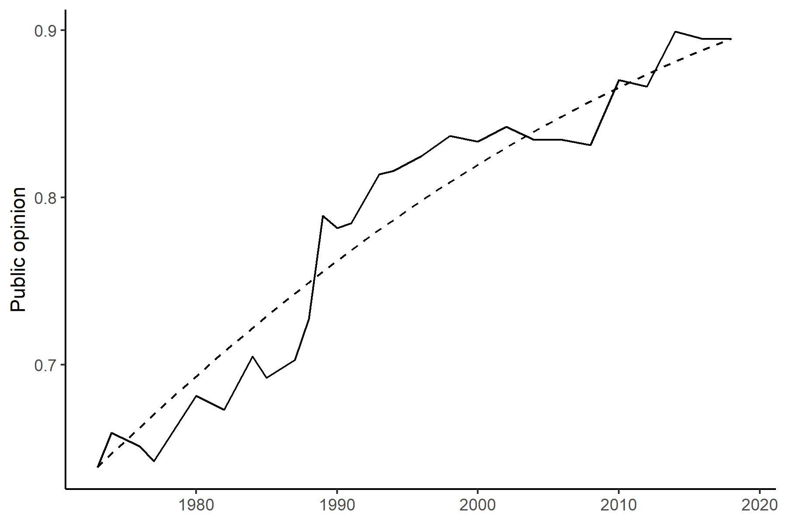

## 2.1 Measuring the argument advantage of moral opinions


```
## # A tibble: 1 x 4
##   `min(n)` `max(n)` `mean(n)` `sum(n)`
##      <int>    <int>     <dbl>    <int>
## 1       98      110      104.     2805
```

```
## # A tibble: 1 x 3
##   `mean(age)` `sd(age)` `mean(sex == "Female", na.rm = TRUE)`
##         <dbl>     <dbl>                                 <dbl>
## 1        36.0      12.5                                 0.592
```

## 2.2 Forecasting shifts of public opinion on moral issues


<div class="figure" style="text-align: center">

<p class="caption">Figure 1. Public opinion change generated by models with a constant positive effect of argument advantage, with (solid) or without (dashed) random error terms. Parameter values: c_i = 0.03, e_i,t N(0, 0.02)</p>
</div>

## 2.3 Assessment of the forecasting models using existing data


<table class=" lightable-classic" style='font-family: "Arial Narrow", "Source Sans Pro", sans-serif; margin-left: auto; margin-right: auto;'>
<caption>Table 1. 2018 point forecast accuracy assessed by the mean squared deviation (MSD) between predicted and observed public opinion in 2018.</caption>
 <thead>
  <tr>
   <th style="text-align:right;"> Starting point (T) </th>
   <th style="text-align:left;"> Parameter values alpha_T, beta_T used for predictions from AA </th>
   <th style="text-align:right;"> MSD_AA </th>
   <th style="text-align:right;"> MSD_Benchmark </th>
   <th style="text-align:right;"> MSD_Trends </th>
   <th style="text-align:left;"> MSD_Benchmark - MSD_AA </th>
   <th style="text-align:left;"> MSD_Trends - MSD_AA </th>
  </tr>
 </thead>
<tbody>
  <tr>
   <td style="text-align:right;"> 2010 </td>
   <td style="text-align:left;"> 0.01, 0.23 </td>
   <td style="text-align:right;"> 44.9 </td>
   <td style="text-align:right;"> 27.8 </td>
   <td style="text-align:right;"> 19.9 </td>
   <td style="text-align:left;"> 25.0 [19.4, 30.4] </td>
   <td style="text-align:left;"> 7.9 [4.4, 11.2] </td>
  </tr>
  <tr>
   <td style="text-align:right;"> 2012 </td>
   <td style="text-align:left;"> 0.01, 0.22 </td>
   <td style="text-align:right;"> 44.7 </td>
   <td style="text-align:right;"> 27.8 </td>
   <td style="text-align:right;"> 25.1 </td>
   <td style="text-align:left;"> 19.6 [15.5, 23.5] </td>
   <td style="text-align:left;"> 2.6 [0.0, 5.1] </td>
  </tr>
  <tr>
   <td style="text-align:right;"> 2014 </td>
   <td style="text-align:left;"> 0.01, 0.23 </td>
   <td style="text-align:right;"> 22.9 </td>
   <td style="text-align:right;"> 18.3 </td>
   <td style="text-align:right;"> 15.5 </td>
   <td style="text-align:left;"> 7.4 [4.7, 10.0] </td>
   <td style="text-align:left;"> 2.8 [1.1, 4.3] </td>
  </tr>
  <tr>
   <td style="text-align:right;"> 2016 </td>
   <td style="text-align:left;"> 0.01, 0.23 </td>
   <td style="text-align:right;"> 8.6 </td>
   <td style="text-align:right;"> 6.5 </td>
   <td style="text-align:right;"> 6.4 </td>
   <td style="text-align:left;"> 2.2 [0.8, 3.5] </td>
   <td style="text-align:left;"> 0.0 [-0.8, 0.7] </td>
  </tr>
</tbody>
</table>


<div class="figure" style="text-align: center">

<p class="caption">Figure 2. The change in the popularity of 63 moral opinions in the United States from 2010 to 2018 as observed in GSS polls (green arrows) and as predicted from argument advantage measures (black arrows). The items are abbreviated in the figure. For the full text of items, see Supplementary Table 1.</p>
</div>

## 3. Predictions


```
## (Intercept)          aa 
## 0.007924077 0.217443898
```


### Supplementary materials

<table class=" lightable-classic" style='font-family: "Arial Narrow", "Source Sans Pro", sans-serif; margin-left: auto; margin-right: auto;'>
<caption>Supplementary Table 1. Forecasts with 50% prediction intervals for 2020 to 2030 for GSS items (on moral issues) that were asked within the last 10 years.</caption>
 <thead>
  <tr>
   <th style="text-align:left;"> Item </th>
   <th style="text-align:left;"> GSS code </th>
   <th style="text-align:right;"> AA </th>
   <th style="text-align:left;"> Latest public opinion </th>
   <th style="text-align:left;"> Forecast 2020 </th>
   <th style="text-align:left;"> Forecast 2022 </th>
   <th style="text-align:left;"> Forecast 2024 </th>
   <th style="text-align:left;"> Forecast 2026 </th>
   <th style="text-align:left;"> Forecast 2028 </th>
   <th style="text-align:left;"> Forecast 2030 </th>
  </tr>
 </thead>
<tbody>
  <tr>
   <td style="text-align:left;"> People should help the less fortunate </td>
   <td style="text-align:left;"> othshelp </td>
   <td style="text-align:right;"> 0.08 </td>
   <td style="text-align:left;"> 0.98 (2014) </td>
   <td style="text-align:left;"> 0.98 [0.97, 0.98] </td>
   <td style="text-align:left;"> 0.98 [0.97, 0.99] </td>
   <td style="text-align:left;"> 0.98 [0.97, 0.99] </td>
   <td style="text-align:left;"> 0.98 [0.97, 0.99] </td>
   <td style="text-align:left;"> 0.98 [0.97, 0.99] </td>
   <td style="text-align:left;"> 0.98 [0.97, 0.99] </td>
  </tr>
  <tr>
   <td style="text-align:left;"> Porn should be illegal </td>
   <td style="text-align:left;"> pornlaw </td>
   <td style="text-align:right;"> -0.16 </td>
   <td style="text-align:left;"> 0.94 (2018) </td>
   <td style="text-align:left;"> 0.94 [0.93, 0.95] </td>
   <td style="text-align:left;"> 0.94 [0.92, 0.95] </td>
   <td style="text-align:left;"> 0.94 [0.92, 0.96] </td>
   <td style="text-align:left;"> 0.94 [0.91, 0.96] </td>
   <td style="text-align:left;"> 0.94 [0.90, 0.96] </td>
   <td style="text-align:left;"> 0.93 [0.90, 0.96] </td>
  </tr>
  <tr>
   <td style="text-align:left;"> Primary duty is to help self and family </td>
   <td style="text-align:left;"> firstyou </td>
   <td style="text-align:right;"> -0.13 </td>
   <td style="text-align:left;"> 0.94 (2018) </td>
   <td style="text-align:left;"> 0.94 [0.92, 0.95] </td>
   <td style="text-align:left;"> 0.93 [0.91, 0.95] </td>
   <td style="text-align:left;"> 0.93 [0.91, 0.95] </td>
   <td style="text-align:left;"> 0.93 [0.90, 0.95] </td>
   <td style="text-align:left;"> 0.93 [0.90, 0.95] </td>
   <td style="text-align:left;"> 0.93 [0.89, 0.95] </td>
  </tr>
  <tr>
   <td style="text-align:left;"> Relative marrying white person </td>
   <td style="text-align:left;"> marwht </td>
   <td style="text-align:right;"> 0.21 </td>
   <td style="text-align:left;"> 0.92 (2018) </td>
   <td style="text-align:left;"> 0.92 [0.91, 0.94] </td>
   <td style="text-align:left;"> 0.93 [0.91, 0.94] </td>
   <td style="text-align:left;"> 0.93 [0.91, 0.95] </td>
   <td style="text-align:left;"> 0.93 [0.91, 0.95] </td>
   <td style="text-align:left;"> 0.94 [0.91, 0.96] </td>
   <td style="text-align:left;"> 0.94 [0.91, 0.96] </td>
  </tr>
  <tr>
   <td style="text-align:left;"> Duty to care for one’s aging parents </td>
   <td style="text-align:left;"> kidpars </td>
   <td style="text-align:right;"> -0.04 </td>
   <td style="text-align:left;"> 0.91 (2018) </td>
   <td style="text-align:left;"> 0.91 [0.90, 0.93] </td>
   <td style="text-align:left;"> 0.91 [0.89, 0.93] </td>
   <td style="text-align:left;"> 0.91 [0.88, 0.94] </td>
   <td style="text-align:left;"> 0.91 [0.88, 0.94] </td>
   <td style="text-align:left;"> 0.91 [0.87, 0.94] </td>
   <td style="text-align:left;"> 0.91 [0.87, 0.94] </td>
  </tr>
  <tr>
   <td style="text-align:left;"> Support sex ed. in public schools </td>
   <td style="text-align:left;"> sexeduc </td>
   <td style="text-align:right;"> 0.11 </td>
   <td style="text-align:left;"> 0.91 (2018) </td>
   <td style="text-align:left;"> 0.92 [0.90, 0.93] </td>
   <td style="text-align:left;"> 0.92 [0.89, 0.94] </td>
   <td style="text-align:left;"> 0.92 [0.89, 0.94] </td>
   <td style="text-align:left;"> 0.92 [0.89, 0.95] </td>
   <td style="text-align:left;"> 0.92 [0.89, 0.95] </td>
   <td style="text-align:left;"> 0.93 [0.89, 0.95] </td>
  </tr>
  <tr>
   <td style="text-align:left;"> Relative marrying person of other faith </td>
   <td style="text-align:left;"> relmarry </td>
   <td style="text-align:right;"> 0.20 </td>
   <td style="text-align:left;"> 0.91 (2018) </td>
   <td style="text-align:left;"> 0.92 [0.90, 0.93] </td>
   <td style="text-align:left;"> 0.92 [0.90, 0.94] </td>
   <td style="text-align:left;"> 0.92 [0.90, 0.94] </td>
   <td style="text-align:left;"> 0.93 [0.90, 0.95] </td>
   <td style="text-align:left;"> 0.93 [0.90, 0.95] </td>
   <td style="text-align:left;"> 0.93 [0.90, 0.96] </td>
  </tr>
  <tr>
   <td style="text-align:left;"> Mothers should be home when school age </td>
   <td style="text-align:left;"> wrksch </td>
   <td style="text-align:right;"> -0.15 </td>
   <td style="text-align:left;"> 0.92 (2012) </td>
   <td style="text-align:left;"> 0.91 [0.87, 0.94] </td>
   <td style="text-align:left;"> 0.91 [0.86, 0.94] </td>
   <td style="text-align:left;"> 0.90 [0.85, 0.94] </td>
   <td style="text-align:left;"> 0.90 [0.84, 0.94] </td>
   <td style="text-align:left;"> 0.90 [0.84, 0.94] </td>
   <td style="text-align:left;"> 0.90 [0.83, 0.94] </td>
  </tr>
  <tr>
   <td style="text-align:left;"> Govt. should impose strict envir. laws </td>
   <td style="text-align:left;"> grnlaws </td>
   <td style="text-align:right;"> 0.03 </td>
   <td style="text-align:left;"> 0.91 (2016) </td>
   <td style="text-align:left;"> 0.91 [0.88, 0.93] </td>
   <td style="text-align:left;"> 0.91 [0.88, 0.94] </td>
   <td style="text-align:left;"> 0.91 [0.88, 0.94] </td>
   <td style="text-align:left;"> 0.91 [0.87, 0.94] </td>
   <td style="text-align:left;"> 0.92 [0.87, 0.95] </td>
   <td style="text-align:left;"> 0.92 [0.87, 0.95] </td>
  </tr>
  <tr>
   <td style="text-align:left;"> Extramarital affairs are wrong </td>
   <td style="text-align:left;"> xmarsex </td>
   <td style="text-align:right;"> -0.07 </td>
   <td style="text-align:left;"> 0.90 (2018) </td>
   <td style="text-align:left;"> 0.90 [0.88, 0.91] </td>
   <td style="text-align:left;"> 0.90 [0.87, 0.92] </td>
   <td style="text-align:left;"> 0.90 [0.86, 0.92] </td>
   <td style="text-align:left;"> 0.90 [0.85, 0.93] </td>
   <td style="text-align:left;"> 0.90 [0.85, 0.93] </td>
   <td style="text-align:left;"> 0.89 [0.84, 0.93] </td>
  </tr>
  <tr>
   <td style="text-align:left;"> Legal abortion for mother’s health </td>
   <td style="text-align:left;"> abhlth </td>
   <td style="text-align:right;"> 0.16 </td>
   <td style="text-align:left;"> 0.90 (2018) </td>
   <td style="text-align:left;"> 0.90 [0.88, 0.92] </td>
   <td style="text-align:left;"> 0.91 [0.88, 0.93] </td>
   <td style="text-align:left;"> 0.91 [0.88, 0.93] </td>
   <td style="text-align:left;"> 0.91 [0.88, 0.94] </td>
   <td style="text-align:left;"> 0.92 [0.87, 0.94] </td>
   <td style="text-align:left;"> 0.92 [0.87, 0.95] </td>
  </tr>
  <tr>
   <td style="text-align:left;"> Allow homosexual to give speech </td>
   <td style="text-align:left;"> spkhomo </td>
   <td style="text-align:right;"> 0.29 </td>
   <td style="text-align:left;"> 0.90 (2018) </td>
   <td style="text-align:left;"> 0.90 [0.88, 0.92] </td>
   <td style="text-align:left;"> 0.91 [0.88, 0.93] </td>
   <td style="text-align:left;"> 0.91 [0.88, 0.94] </td>
   <td style="text-align:left;"> 0.92 [0.88, 0.94] </td>
   <td style="text-align:left;"> 0.92 [0.89, 0.95] </td>
   <td style="text-align:left;"> 0.93 [0.89, 0.95] </td>
  </tr>
  <tr>
   <td style="text-align:left;"> Accept homosexual college professor </td>
   <td style="text-align:left;"> colhomo </td>
   <td style="text-align:right;"> 0.35 </td>
   <td style="text-align:left;"> 0.89 (2018) </td>
   <td style="text-align:left;"> 0.90 [0.88, 0.91] </td>
   <td style="text-align:left;"> 0.90 [0.88, 0.93] </td>
   <td style="text-align:left;"> 0.91 [0.88, 0.93] </td>
   <td style="text-align:left;"> 0.92 [0.88, 0.94] </td>
   <td style="text-align:left;"> 0.92 [0.89, 0.95] </td>
   <td style="text-align:left;"> 0.93 [0.89, 0.96] </td>
  </tr>
  <tr>
   <td style="text-align:left;"> Both husband &amp; wife should have incomes </td>
   <td style="text-align:left;"> twoincs </td>
   <td style="text-align:right;"> 0.11 </td>
   <td style="text-align:left;"> 0.86 (2012) </td>
   <td style="text-align:left;"> 0.88 [0.83, 0.91] </td>
   <td style="text-align:left;"> 0.88 [0.82, 0.92] </td>
   <td style="text-align:left;"> 0.88 [0.82, 0.92] </td>
   <td style="text-align:left;"> 0.89 [0.82, 0.93] </td>
   <td style="text-align:left;"> 0.89 [0.82, 0.93] </td>
   <td style="text-align:left;"> 0.89 [0.82, 0.94] </td>
  </tr>
  <tr>
   <td style="text-align:left;"> Should help less fortunate friends </td>
   <td style="text-align:left;"> helpfrds </td>
   <td style="text-align:right;"> 0.03 </td>
   <td style="text-align:left;"> 0.87 (2018) </td>
   <td style="text-align:left;"> 0.87 [0.84, 0.89] </td>
   <td style="text-align:left;"> 0.87 [0.83, 0.90] </td>
   <td style="text-align:left;"> 0.87 [0.83, 0.90] </td>
   <td style="text-align:left;"> 0.87 [0.82, 0.91] </td>
   <td style="text-align:left;"> 0.87 [0.82, 0.92] </td>
   <td style="text-align:left;"> 0.88 [0.81, 0.92] </td>
  </tr>
  <tr>
   <td style="text-align:left;"> Govt. should fund basic research </td>
   <td style="text-align:left;"> advfront </td>
   <td style="text-align:right;"> 0.07 </td>
   <td style="text-align:left;"> 0.86 (2018) </td>
   <td style="text-align:left;"> 0.86 [0.84, 0.89] </td>
   <td style="text-align:left;"> 0.87 [0.83, 0.90] </td>
   <td style="text-align:left;"> 0.87 [0.83, 0.90] </td>
   <td style="text-align:left;"> 0.87 [0.82, 0.91] </td>
   <td style="text-align:left;"> 0.87 [0.82, 0.92] </td>
   <td style="text-align:left;"> 0.88 [0.81, 0.92] </td>
  </tr>
  <tr>
   <td style="text-align:left;"> Ok for police to strike back if punched </td>
   <td style="text-align:left;"> polattak </td>
   <td style="text-align:right;"> -0.06 </td>
   <td style="text-align:left;"> 0.86 (2018) </td>
   <td style="text-align:left;"> 0.86 [0.83, 0.88] </td>
   <td style="text-align:left;"> 0.86 [0.82, 0.89] </td>
   <td style="text-align:left;"> 0.86 [0.81, 0.89] </td>
   <td style="text-align:left;"> 0.86 [0.80, 0.90] </td>
   <td style="text-align:left;"> 0.86 [0.79, 0.90] </td>
   <td style="text-align:left;"> 0.86 [0.78, 0.91] </td>
  </tr>
  <tr>
   <td style="text-align:left;"> Religious leaders shouldn’t sway voters </td>
   <td style="text-align:left;"> clergvte </td>
   <td style="text-align:right;"> 0.04 </td>
   <td style="text-align:left;"> 0.85 (2018) </td>
   <td style="text-align:left;"> 0.85 [0.82, 0.87] </td>
   <td style="text-align:left;"> 0.85 [0.81, 0.88] </td>
   <td style="text-align:left;"> 0.86 [0.81, 0.89] </td>
   <td style="text-align:left;"> 0.86 [0.80, 0.90] </td>
   <td style="text-align:left;"> 0.86 [0.80, 0.90] </td>
   <td style="text-align:left;"> 0.86 [0.79, 0.91] </td>
  </tr>
  <tr>
   <td style="text-align:left;"> Allow publishing of revolutionary books </td>
   <td style="text-align:left;"> revpub </td>
   <td style="text-align:right;"> 0.07 </td>
   <td style="text-align:left;"> 0.84 (2016) </td>
   <td style="text-align:left;"> 0.85 [0.81, 0.88] </td>
   <td style="text-align:left;"> 0.85 [0.80, 0.89] </td>
   <td style="text-align:left;"> 0.85 [0.80, 0.90] </td>
   <td style="text-align:left;"> 0.86 [0.79, 0.90] </td>
   <td style="text-align:left;"> 0.86 [0.79, 0.91] </td>
   <td style="text-align:left;"> 0.86 [0.79, 0.91] </td>
  </tr>
  <tr>
   <td style="text-align:left;"> Allow demonstrations against govt. </td>
   <td style="text-align:left;"> protest3 </td>
   <td style="text-align:right;"> 0.24 </td>
   <td style="text-align:left;"> 0.83 (2016) </td>
   <td style="text-align:left;"> 0.84 [0.80, 0.88] </td>
   <td style="text-align:left;"> 0.85 [0.80, 0.89] </td>
   <td style="text-align:left;"> 0.86 [0.80, 0.90] </td>
   <td style="text-align:left;"> 0.87 [0.81, 0.91] </td>
   <td style="text-align:left;"> 0.87 [0.81, 0.92] </td>
   <td style="text-align:left;"> 0.88 [0.81, 0.92] </td>
  </tr>
  <tr>
   <td style="text-align:left;"> Relative marrying Asian person </td>
   <td style="text-align:left;"> marasian </td>
   <td style="text-align:right;"> 0.32 </td>
   <td style="text-align:left;"> 0.83 (2018) </td>
   <td style="text-align:left;"> 0.84 [0.82, 0.87] </td>
   <td style="text-align:left;"> 0.85 [0.82, 0.89] </td>
   <td style="text-align:left;"> 0.86 [0.82, 0.90] </td>
   <td style="text-align:left;"> 0.87 [0.82, 0.91] </td>
   <td style="text-align:left;"> 0.88 [0.83, 0.92] </td>
   <td style="text-align:left;"> 0.89 [0.83, 0.93] </td>
  </tr>
  <tr>
   <td style="text-align:left;"> Allow public meetings against govt. </td>
   <td style="text-align:left;"> protest1 </td>
   <td style="text-align:right;"> 0.25 </td>
   <td style="text-align:left;"> 0.82 (2016) </td>
   <td style="text-align:left;"> 0.84 [0.80, 0.87] </td>
   <td style="text-align:left;"> 0.85 [0.80, 0.89] </td>
   <td style="text-align:left;"> 0.85 [0.80, 0.90] </td>
   <td style="text-align:left;"> 0.86 [0.80, 0.91] </td>
   <td style="text-align:left;"> 0.87 [0.81, 0.92] </td>
   <td style="text-align:left;"> 0.88 [0.81, 0.92] </td>
  </tr>
  <tr>
   <td style="text-align:left;"> Relative marrying Hispanic person </td>
   <td style="text-align:left;"> marhisp </td>
   <td style="text-align:right;"> 0.29 </td>
   <td style="text-align:left;"> 0.83 (2018) </td>
   <td style="text-align:left;"> 0.84 [0.81, 0.86] </td>
   <td style="text-align:left;"> 0.85 [0.81, 0.88] </td>
   <td style="text-align:left;"> 0.86 [0.81, 0.89] </td>
   <td style="text-align:left;"> 0.86 [0.81, 0.90] </td>
   <td style="text-align:left;"> 0.87 [0.82, 0.91] </td>
   <td style="text-align:left;"> 0.88 [0.82, 0.92] </td>
  </tr>
  <tr>
   <td style="text-align:left;"> Allow antireligious speeches </td>
   <td style="text-align:left;"> spkath </td>
   <td style="text-align:right;"> 0.21 </td>
   <td style="text-align:left;"> 0.81 (2018) </td>
   <td style="text-align:left;"> 0.81 [0.78, 0.84] </td>
   <td style="text-align:left;"> 0.82 [0.78, 0.86] </td>
   <td style="text-align:left;"> 0.83 [0.78, 0.87] </td>
   <td style="text-align:left;"> 0.84 [0.78, 0.88] </td>
   <td style="text-align:left;"> 0.84 [0.78, 0.89] </td>
   <td style="text-align:left;"> 0.85 [0.78, 0.90] </td>
  </tr>
  <tr>
   <td style="text-align:left;"> Extra effort to hire qualified women </td>
   <td style="text-align:left;"> fehire </td>
   <td style="text-align:right;"> -0.01 </td>
   <td style="text-align:left;"> 0.80 (2018) </td>
   <td style="text-align:left;"> 0.80 [0.77, 0.83] </td>
   <td style="text-align:left;"> 0.80 [0.75, 0.84] </td>
   <td style="text-align:left;"> 0.80 [0.74, 0.85] </td>
   <td style="text-align:left;"> 0.80 [0.73, 0.86] </td>
   <td style="text-align:left;"> 0.81 [0.73, 0.87] </td>
   <td style="text-align:left;"> 0.81 [0.72, 0.87] </td>
  </tr>
  <tr>
   <td style="text-align:left;"> Rather free guilty vs. convict innocent </td>
   <td style="text-align:left;"> verdict </td>
   <td style="text-align:right;"> 0.15 </td>
   <td style="text-align:left;"> 0.78 (2016) </td>
   <td style="text-align:left;"> 0.80 [0.75, 0.84] </td>
   <td style="text-align:left;"> 0.81 [0.75, 0.85] </td>
   <td style="text-align:left;"> 0.81 [0.74, 0.86] </td>
   <td style="text-align:left;"> 0.82 [0.74, 0.87] </td>
   <td style="text-align:left;"> 0.82 [0.74, 0.88] </td>
   <td style="text-align:left;"> 0.83 [0.74, 0.89] </td>
  </tr>
  <tr>
   <td style="text-align:left;"> Abortion legal for rape victims </td>
   <td style="text-align:left;"> abrape </td>
   <td style="text-align:right;"> 0.14 </td>
   <td style="text-align:left;"> 0.79 (2018) </td>
   <td style="text-align:left;"> 0.79 [0.76, 0.82] </td>
   <td style="text-align:left;"> 0.80 [0.75, 0.84] </td>
   <td style="text-align:left;"> 0.81 [0.75, 0.85] </td>
   <td style="text-align:left;"> 0.81 [0.74, 0.86] </td>
   <td style="text-align:left;"> 0.82 [0.74, 0.87] </td>
   <td style="text-align:left;"> 0.82 [0.74, 0.88] </td>
  </tr>
  <tr>
   <td style="text-align:left;"> Allow revolutionary groups to meet </td>
   <td style="text-align:left;"> revspeak </td>
   <td style="text-align:right;"> 0.11 </td>
   <td style="text-align:left;"> 0.77 (2016) </td>
   <td style="text-align:left;"> 0.78 [0.72, 0.82] </td>
   <td style="text-align:left;"> 0.78 [0.72, 0.83] </td>
   <td style="text-align:left;"> 0.79 [0.71, 0.85] </td>
   <td style="text-align:left;"> 0.79 [0.71, 0.86] </td>
   <td style="text-align:left;"> 0.80 [0.71, 0.86] </td>
   <td style="text-align:left;"> 0.80 [0.71, 0.87] </td>
  </tr>
  <tr>
   <td style="text-align:left;"> Relative marrying Black person </td>
   <td style="text-align:left;"> marblk </td>
   <td style="text-align:right;"> 0.36 </td>
   <td style="text-align:left;"> 0.77 (2018) </td>
   <td style="text-align:left;"> 0.79 [0.75, 0.82] </td>
   <td style="text-align:left;"> 0.80 [0.75, 0.84] </td>
   <td style="text-align:left;"> 0.81 [0.76, 0.86] </td>
   <td style="text-align:left;"> 0.83 [0.76, 0.88] </td>
   <td style="text-align:left;"> 0.84 [0.77, 0.89] </td>
   <td style="text-align:left;"> 0.85 [0.78, 0.90] </td>
  </tr>
  <tr>
   <td style="text-align:left;"> Some solutions require intl. enforcing </td>
   <td style="text-align:left;"> wrldgovt </td>
   <td style="text-align:right;"> -0.02 </td>
   <td style="text-align:left;"> 0.77 (2014) </td>
   <td style="text-align:left;"> 0.77 [0.70, 0.82] </td>
   <td style="text-align:left;"> 0.77 [0.69, 0.83] </td>
   <td style="text-align:left;"> 0.77 [0.68, 0.84] </td>
   <td style="text-align:left;"> 0.77 [0.68, 0.85] </td>
   <td style="text-align:left;"> 0.77 [0.67, 0.85] </td>
   <td style="text-align:left;"> 0.77 [0.66, 0.86] </td>
  </tr>
  <tr>
   <td style="text-align:left;"> Legal abortion for fetal defects </td>
   <td style="text-align:left;"> abdefect </td>
   <td style="text-align:right;"> 0.03 </td>
   <td style="text-align:left;"> 0.76 (2018) </td>
   <td style="text-align:left;"> 0.77 [0.73, 0.80] </td>
   <td style="text-align:left;"> 0.77 [0.72, 0.81] </td>
   <td style="text-align:left;"> 0.77 [0.71, 0.83] </td>
   <td style="text-align:left;"> 0.77 [0.70, 0.84] </td>
   <td style="text-align:left;"> 0.78 [0.69, 0.84] </td>
   <td style="text-align:left;"> 0.78 [0.68, 0.85] </td>
  </tr>
  <tr>
   <td style="text-align:left;"> Govt. should help pay for health care </td>
   <td style="text-align:left;"> helpsick </td>
   <td style="text-align:right;"> 0.24 </td>
   <td style="text-align:left;"> 0.76 (2018) </td>
   <td style="text-align:left;"> 0.77 [0.74, 0.81] </td>
   <td style="text-align:left;"> 0.78 [0.73, 0.83] </td>
   <td style="text-align:left;"> 0.79 [0.73, 0.84] </td>
   <td style="text-align:left;"> 0.80 [0.73, 0.86] </td>
   <td style="text-align:left;"> 0.81 [0.74, 0.87] </td>
   <td style="text-align:left;"> 0.82 [0.74, 0.88] </td>
  </tr>
  <tr>
   <td style="text-align:left;"> Allow religious extremists to meet2 </td>
   <td style="text-align:left;"> relmeet </td>
   <td style="text-align:right;"> 0.05 </td>
   <td style="text-align:left;"> 0.75 (2014) </td>
   <td style="text-align:left;"> 0.76 [0.70, 0.82] </td>
   <td style="text-align:left;"> 0.77 [0.69, 0.83] </td>
   <td style="text-align:left;"> 0.77 [0.68, 0.84] </td>
   <td style="text-align:left;"> 0.77 [0.68, 0.85] </td>
   <td style="text-align:left;"> 0.78 [0.67, 0.85] </td>
   <td style="text-align:left;"> 0.78 [0.67, 0.86] </td>
  </tr>
  <tr>
   <td style="text-align:left;"> Same-sex marriage </td>
   <td style="text-align:left;"> marhomo </td>
   <td style="text-align:right;"> 0.41 </td>
   <td style="text-align:left;"> 0.75 (2018) </td>
   <td style="text-align:left;"> 0.77 [0.74, 0.80] </td>
   <td style="text-align:left;"> 0.79 [0.74, 0.83] </td>
   <td style="text-align:left;"> 0.80 [0.74, 0.85] </td>
   <td style="text-align:left;"> 0.82 [0.75, 0.87] </td>
   <td style="text-align:left;"> 0.83 [0.76, 0.89] </td>
   <td style="text-align:left;"> 0.85 [0.77, 0.90] </td>
  </tr>
  <tr>
   <td style="text-align:left;"> Premarital sex wrong for early teens </td>
   <td style="text-align:left;"> teensex </td>
   <td style="text-align:right;"> -0.17 </td>
   <td style="text-align:left;"> 0.75 (2018) </td>
   <td style="text-align:left;"> 0.74 [0.70, 0.78] </td>
   <td style="text-align:left;"> 0.74 [0.68, 0.79] </td>
   <td style="text-align:left;"> 0.73 [0.66, 0.79] </td>
   <td style="text-align:left;"> 0.72 [0.64, 0.80] </td>
   <td style="text-align:left;"> 0.72 [0.62, 0.80] </td>
   <td style="text-align:left;"> 0.71 [0.61, 0.80] </td>
  </tr>
  <tr>
   <td style="text-align:left;"> Should marry before having children </td>
   <td style="text-align:left;"> marlegit </td>
   <td style="text-align:right;"> -0.23 </td>
   <td style="text-align:left;"> 0.75 (2012) </td>
   <td style="text-align:left;"> 0.72 [0.64, 0.79] </td>
   <td style="text-align:left;"> 0.71 [0.61, 0.79] </td>
   <td style="text-align:left;"> 0.70 [0.59, 0.79] </td>
   <td style="text-align:left;"> 0.70 [0.58, 0.79] </td>
   <td style="text-align:left;"> 0.69 [0.56, 0.79] </td>
   <td style="text-align:left;"> 0.68 [0.54, 0.79] </td>
  </tr>
  <tr>
   <td style="text-align:left;"> Allow pro-military coup speeches </td>
   <td style="text-align:left;"> spkmil </td>
   <td style="text-align:right;"> 0.17 </td>
   <td style="text-align:left;"> 0.73 (2018) </td>
   <td style="text-align:left;"> 0.74 [0.70, 0.77] </td>
   <td style="text-align:left;"> 0.75 [0.69, 0.80] </td>
   <td style="text-align:left;"> 0.76 [0.69, 0.81] </td>
   <td style="text-align:left;"> 0.76 [0.69, 0.83] </td>
   <td style="text-align:left;"> 0.77 [0.69, 0.84] </td>
   <td style="text-align:left;"> 0.78 [0.69, 0.85] </td>
  </tr>
  <tr>
   <td style="text-align:left;"> Legalize euthanasia </td>
   <td style="text-align:left;"> letdie1 </td>
   <td style="text-align:right;"> 0.17 </td>
   <td style="text-align:left;"> 0.72 (2018) </td>
   <td style="text-align:left;"> 0.73 [0.69, 0.77] </td>
   <td style="text-align:left;"> 0.74 [0.68, 0.79] </td>
   <td style="text-align:left;"> 0.75 [0.68, 0.81] </td>
   <td style="text-align:left;"> 0.76 [0.68, 0.82] </td>
   <td style="text-align:left;"> 0.77 [0.68, 0.84] </td>
   <td style="text-align:left;"> 0.77 [0.68, 0.85] </td>
  </tr>
  <tr>
   <td style="text-align:left;"> Buying gun should require police permit </td>
   <td style="text-align:left;"> gunlaw </td>
   <td style="text-align:right;"> -0.05 </td>
   <td style="text-align:left;"> 0.72 (2018) </td>
   <td style="text-align:left;"> 0.72 [0.68, 0.76] </td>
   <td style="text-align:left;"> 0.72 [0.66, 0.77] </td>
   <td style="text-align:left;"> 0.72 [0.64, 0.78] </td>
   <td style="text-align:left;"> 0.72 [0.63, 0.79] </td>
   <td style="text-align:left;"> 0.72 [0.62, 0.80] </td>
   <td style="text-align:left;"> 0.72 [0.61, 0.80] </td>
  </tr>
  <tr>
   <td style="text-align:left;"> Those in need must learn self-reliance </td>
   <td style="text-align:left;"> careself </td>
   <td style="text-align:right;"> -0.14 </td>
   <td style="text-align:left;"> 0.72 (2014) </td>
   <td style="text-align:left;"> 0.71 [0.63, 0.77] </td>
   <td style="text-align:left;"> 0.70 [0.61, 0.78] </td>
   <td style="text-align:left;"> 0.70 [0.60, 0.78] </td>
   <td style="text-align:left;"> 0.69 [0.58, 0.79] </td>
   <td style="text-align:left;"> 0.69 [0.57, 0.79] </td>
   <td style="text-align:left;"> 0.68 [0.55, 0.79] </td>
  </tr>
  <tr>
   <td style="text-align:left;"> Blacks shouldn’t get special treatment </td>
   <td style="text-align:left;"> wrkwayup </td>
   <td style="text-align:right;"> -0.02 </td>
   <td style="text-align:left;"> 0.70 (2018) </td>
   <td style="text-align:left;"> 0.70 [0.66, 0.74] </td>
   <td style="text-align:left;"> 0.70 [0.64, 0.76] </td>
   <td style="text-align:left;"> 0.70 [0.63, 0.77] </td>
   <td style="text-align:left;"> 0.71 [0.62, 0.78] </td>
   <td style="text-align:left;"> 0.71 [0.61, 0.79] </td>
   <td style="text-align:left;"> 0.71 [0.60, 0.80] </td>
  </tr>
  <tr>
   <td style="text-align:left;"> Allow Communist to give speech. </td>
   <td style="text-align:left;"> spkcom </td>
   <td style="text-align:right;"> 0.23 </td>
   <td style="text-align:left;"> 0.70 (2018) </td>
   <td style="text-align:left;"> 0.71 [0.67, 0.75] </td>
   <td style="text-align:left;"> 0.72 [0.66, 0.77] </td>
   <td style="text-align:left;"> 0.73 [0.66, 0.79] </td>
   <td style="text-align:left;"> 0.74 [0.66, 0.81] </td>
   <td style="text-align:left;"> 0.75 [0.66, 0.83] </td>
   <td style="text-align:left;"> 0.76 [0.67, 0.84] </td>
  </tr>
  <tr>
   <td style="text-align:left;"> Cohabitation is alright </td>
   <td style="text-align:left;"> cohabok </td>
   <td style="text-align:right;"> 0.21 </td>
   <td style="text-align:left;"> 0.66 (2012) </td>
   <td style="text-align:left;"> 0.70 [0.61, 0.78] </td>
   <td style="text-align:left;"> 0.71 [0.62, 0.79] </td>
   <td style="text-align:left;"> 0.72 [0.62, 0.81] </td>
   <td style="text-align:left;"> 0.74 [0.62, 0.82] </td>
   <td style="text-align:left;"> 0.75 [0.63, 0.84] </td>
   <td style="text-align:left;"> 0.76 [0.63, 0.85] </td>
  </tr>
  <tr>
   <td style="text-align:left;"> Ok for police to strike if person flees </td>
   <td style="text-align:left;"> polescap </td>
   <td style="text-align:right;"> -0.23 </td>
   <td style="text-align:left;"> 0.69 (2018) </td>
   <td style="text-align:left;"> 0.68 [0.63, 0.72] </td>
   <td style="text-align:left;"> 0.67 [0.60, 0.73] </td>
   <td style="text-align:left;"> 0.66 [0.58, 0.73] </td>
   <td style="text-align:left;"> 0.65 [0.56, 0.73] </td>
   <td style="text-align:left;"> 0.64 [0.53, 0.73] </td>
   <td style="text-align:left;"> 0.63 [0.51, 0.73] </td>
  </tr>
  <tr>
   <td style="text-align:left;"> Allow antireligious college professors </td>
   <td style="text-align:left;"> colath </td>
   <td style="text-align:right;"> 0.24 </td>
   <td style="text-align:left;"> 0.68 (2018) </td>
   <td style="text-align:left;"> 0.70 [0.65, 0.74] </td>
   <td style="text-align:left;"> 0.71 [0.65, 0.76] </td>
   <td style="text-align:left;"> 0.72 [0.65, 0.78] </td>
   <td style="text-align:left;"> 0.73 [0.65, 0.80] </td>
   <td style="text-align:left;"> 0.75 [0.65, 0.82] </td>
   <td style="text-align:left;"> 0.76 [0.66, 0.83] </td>
  </tr>
  <tr>
   <td style="text-align:left;"> Sometimes children need spanking </td>
   <td style="text-align:left;"> spanking </td>
   <td style="text-align:right;"> -0.25 </td>
   <td style="text-align:left;"> 0.67 (2018) </td>
   <td style="text-align:left;"> 0.66 [0.61, 0.70] </td>
   <td style="text-align:left;"> 0.65 [0.58, 0.71] </td>
   <td style="text-align:left;"> 0.64 [0.56, 0.71] </td>
   <td style="text-align:left;"> 0.63 [0.53, 0.71] </td>
   <td style="text-align:left;"> 0.62 [0.51, 0.71] </td>
   <td style="text-align:left;"> 0.60 [0.48, 0.71] </td>
  </tr>
  <tr>
   <td style="text-align:left;"> Legalize marijuana </td>
   <td style="text-align:left;"> grass </td>
   <td style="text-align:right;"> 0.23 </td>
   <td style="text-align:left;"> 0.66 (2018) </td>
   <td style="text-align:left;"> 0.68 [0.63, 0.72] </td>
   <td style="text-align:left;"> 0.69 [0.63, 0.75] </td>
   <td style="text-align:left;"> 0.70 [0.63, 0.77] </td>
   <td style="text-align:left;"> 0.71 [0.63, 0.79] </td>
   <td style="text-align:left;"> 0.73 [0.63, 0.80] </td>
   <td style="text-align:left;"> 0.74 [0.63, 0.82] </td>
  </tr>
  <tr>
   <td style="text-align:left;"> Terminally ill have right to suicide </td>
   <td style="text-align:left;"> suicide1 </td>
   <td style="text-align:right;"> 0.11 </td>
   <td style="text-align:left;"> 0.66 (2018) </td>
   <td style="text-align:left;"> 0.67 [0.62, 0.71] </td>
   <td style="text-align:left;"> 0.67 [0.61, 0.73] </td>
   <td style="text-align:left;"> 0.68 [0.60, 0.75] </td>
   <td style="text-align:left;"> 0.69 [0.60, 0.77] </td>
   <td style="text-align:left;"> 0.70 [0.60, 0.78] </td>
   <td style="text-align:left;"> 0.70 [0.59, 0.79] </td>
  </tr>
  <tr>
   <td style="text-align:left;"> Govt. video surveillance is ok </td>
   <td style="text-align:left;"> cctv </td>
   <td style="text-align:right;"> -0.04 </td>
   <td style="text-align:left;"> 0.65 (2016) </td>
   <td style="text-align:left;"> 0.65 [0.59, 0.71] </td>
   <td style="text-align:left;"> 0.65 [0.57, 0.72] </td>
   <td style="text-align:left;"> 0.65 [0.56, 0.73] </td>
   <td style="text-align:left;"> 0.65 [0.55, 0.74] </td>
   <td style="text-align:left;"> 0.65 [0.53, 0.75] </td>
   <td style="text-align:left;"> 0.65 [0.52, 0.76] </td>
  </tr>
  <tr>
   <td style="text-align:left;"> Police may sometimes hit male citizens </td>
   <td style="text-align:left;"> polhitok </td>
   <td style="text-align:right;"> -0.12 </td>
   <td style="text-align:left;"> 0.64 (2018) </td>
   <td style="text-align:left;"> 0.64 [0.59, 0.68] </td>
   <td style="text-align:left;"> 0.63 [0.56, 0.69] </td>
   <td style="text-align:left;"> 0.63 [0.54, 0.70] </td>
   <td style="text-align:left;"> 0.62 [0.53, 0.71] </td>
   <td style="text-align:left;"> 0.62 [0.51, 0.71] </td>
   <td style="text-align:left;"> 0.61 [0.49, 0.72] </td>
  </tr>
  <tr>
   <td style="text-align:left;"> Death penalty for convicted murderers </td>
   <td style="text-align:left;"> cappun </td>
   <td style="text-align:right;"> -0.14 </td>
   <td style="text-align:left;"> 0.64 (2018) </td>
   <td style="text-align:left;"> 0.63 [0.58, 0.67] </td>
   <td style="text-align:left;"> 0.62 [0.56, 0.69] </td>
   <td style="text-align:left;"> 0.62 [0.54, 0.70] </td>
   <td style="text-align:left;"> 0.61 [0.52, 0.70] </td>
   <td style="text-align:left;"> 0.61 [0.50, 0.71] </td>
   <td style="text-align:left;"> 0.60 [0.48, 0.71] </td>
  </tr>
  <tr>
   <td style="text-align:left;"> Birth control without parental approval </td>
   <td style="text-align:left;"> pillok </td>
   <td style="text-align:right;"> 0.28 </td>
   <td style="text-align:left;"> 0.61 (2018) </td>
   <td style="text-align:left;"> 0.63 [0.58, 0.67] </td>
   <td style="text-align:left;"> 0.64 [0.58, 0.71] </td>
   <td style="text-align:left;"> 0.66 [0.58, 0.73] </td>
   <td style="text-align:left;"> 0.68 [0.58, 0.76] </td>
   <td style="text-align:left;"> 0.69 [0.59, 0.78] </td>
   <td style="text-align:left;"> 0.71 [0.60, 0.80] </td>
  </tr>
  <tr>
   <td style="text-align:left;"> Allow teacher who is pro-military coup </td>
   <td style="text-align:left;"> colmil </td>
   <td style="text-align:right;"> 0.16 </td>
   <td style="text-align:left;"> 0.61 (2018) </td>
   <td style="text-align:left;"> 0.62 [0.57, 0.66] </td>
   <td style="text-align:left;"> 0.63 [0.56, 0.69] </td>
   <td style="text-align:left;"> 0.64 [0.55, 0.71] </td>
   <td style="text-align:left;"> 0.64 [0.55, 0.73] </td>
   <td style="text-align:left;"> 0.65 [0.55, 0.75] </td>
   <td style="text-align:left;"> 0.66 [0.55, 0.76] </td>
  </tr>
  <tr>
   <td style="text-align:left;"> US should forcefully seek its interests </td>
   <td style="text-align:left;"> amownway </td>
   <td style="text-align:right;"> -0.13 </td>
   <td style="text-align:left;"> 0.60 (2014) </td>
   <td style="text-align:left;"> 0.59 [0.50, 0.67] </td>
   <td style="text-align:left;"> 0.58 [0.49, 0.67] </td>
   <td style="text-align:left;"> 0.58 [0.47, 0.68] </td>
   <td style="text-align:left;"> 0.57 [0.45, 0.68] </td>
   <td style="text-align:left;"> 0.57 [0.44, 0.69] </td>
   <td style="text-align:left;"> 0.56 [0.42, 0.69] </td>
  </tr>
  <tr>
   <td style="text-align:left;"> Govt. should raise living stds of poor </td>
   <td style="text-align:left;"> helppoor </td>
   <td style="text-align:right;"> 0.18 </td>
   <td style="text-align:left;"> 0.57 (2018) </td>
   <td style="text-align:left;"> 0.59 [0.54, 0.63] </td>
   <td style="text-align:left;"> 0.60 [0.53, 0.66] </td>
   <td style="text-align:left;"> 0.61 [0.52, 0.69] </td>
   <td style="text-align:left;"> 0.62 [0.52, 0.71] </td>
   <td style="text-align:left;"> 0.63 [0.52, 0.73] </td>
   <td style="text-align:left;"> 0.64 [0.53, 0.74] </td>
  </tr>
  <tr>
   <td style="text-align:left;"> Allow speech by race science proponents </td>
   <td style="text-align:left;"> spkrac </td>
   <td style="text-align:right;"> 0.01 </td>
   <td style="text-align:left;"> 0.57 (2018) </td>
   <td style="text-align:left;"> 0.57 [0.52, 0.62] </td>
   <td style="text-align:left;"> 0.57 [0.50, 0.64] </td>
   <td style="text-align:left;"> 0.57 [0.49, 0.66] </td>
   <td style="text-align:left;"> 0.58 [0.48, 0.67] </td>
   <td style="text-align:left;"> 0.58 [0.47, 0.68] </td>
   <td style="text-align:left;"> 0.58 [0.46, 0.69] </td>
  </tr>
  <tr>
   <td style="text-align:left;"> Allow religious extremists to meet1 </td>
   <td style="text-align:left;"> relext1 </td>
   <td style="text-align:right;"> 0.04 </td>
   <td style="text-align:left;"> 0.56 (2018) </td>
   <td style="text-align:left;"> 0.57 [0.52, 0.61] </td>
   <td style="text-align:left;"> 0.57 [0.50, 0.64] </td>
   <td style="text-align:left;"> 0.57 [0.49, 0.65] </td>
   <td style="text-align:left;"> 0.58 [0.48, 0.67] </td>
   <td style="text-align:left;"> 0.58 [0.47, 0.68] </td>
   <td style="text-align:left;"> 0.58 [0.46, 0.69] </td>
  </tr>
  <tr>
   <td style="text-align:left;"> Abortion due to poverty is wrong </td>
   <td style="text-align:left;"> abpoorw </td>
   <td style="text-align:right;"> -0.04 </td>
   <td style="text-align:left;"> 0.56 (2018) </td>
   <td style="text-align:left;"> 0.56 [0.51, 0.60] </td>
   <td style="text-align:left;"> 0.56 [0.49, 0.62] </td>
   <td style="text-align:left;"> 0.56 [0.47, 0.64] </td>
   <td style="text-align:left;"> 0.55 [0.46, 0.65] </td>
   <td style="text-align:left;"> 0.55 [0.44, 0.66] </td>
   <td style="text-align:left;"> 0.55 [0.43, 0.67] </td>
  </tr>
  <tr>
   <td style="text-align:left;"> Allow wiretapping to prevent terrorism </td>
   <td style="text-align:left;"> tapphone </td>
   <td style="text-align:right;"> 0.01 </td>
   <td style="text-align:left;"> 0.51 (2016) </td>
   <td style="text-align:left;"> 0.52 [0.45, 0.59] </td>
   <td style="text-align:left;"> 0.52 [0.44, 0.60] </td>
   <td style="text-align:left;"> 0.52 [0.43, 0.62] </td>
   <td style="text-align:left;"> 0.53 [0.42, 0.63] </td>
   <td style="text-align:left;"> 0.53 [0.41, 0.64] </td>
   <td style="text-align:left;"> 0.53 [0.40, 0.66] </td>
  </tr>
  <tr>
   <td style="text-align:left;"> Legal abortion for married women </td>
   <td style="text-align:left;"> abnomore </td>
   <td style="text-align:right;"> 0.05 </td>
   <td style="text-align:left;"> 0.50 (2018) </td>
   <td style="text-align:left;"> 0.51 [0.46, 0.56] </td>
   <td style="text-align:left;"> 0.51 [0.44, 0.58] </td>
   <td style="text-align:left;"> 0.52 [0.43, 0.60] </td>
   <td style="text-align:left;"> 0.52 [0.42, 0.62] </td>
   <td style="text-align:left;"> 0.53 [0.42, 0.63] </td>
   <td style="text-align:left;"> 0.53 [0.41, 0.65] </td>
  </tr>
  <tr>
   <td style="text-align:left;"> Abortion should be legal for any reason </td>
   <td style="text-align:left;"> abany </td>
   <td style="text-align:right;"> 0.00 </td>
   <td style="text-align:left;"> 0.50 (2018) </td>
   <td style="text-align:left;"> 0.50 [0.45, 0.55] </td>
   <td style="text-align:left;"> 0.50 [0.43, 0.57] </td>
   <td style="text-align:left;"> 0.51 [0.42, 0.59] </td>
   <td style="text-align:left;"> 0.51 [0.41, 0.61] </td>
   <td style="text-align:left;"> 0.51 [0.40, 0.62] </td>
   <td style="text-align:left;"> 0.51 [0.39, 0.63] </td>
  </tr>
  <tr>
   <td style="text-align:left;"> Govt. may spy on people inside the US </td>
   <td style="text-align:left;"> givinfusa </td>
   <td style="text-align:right;"> -0.11 </td>
   <td style="text-align:left;"> 0.49 (2016) </td>
   <td style="text-align:left;"> 0.48 [0.42, 0.55] </td>
   <td style="text-align:left;"> 0.48 [0.40, 0.56] </td>
   <td style="text-align:left;"> 0.48 [0.38, 0.57] </td>
   <td style="text-align:left;"> 0.47 [0.37, 0.58] </td>
   <td style="text-align:left;"> 0.47 [0.35, 0.59] </td>
   <td style="text-align:left;"> 0.46 [0.34, 0.59] </td>
  </tr>
  <tr>
   <td style="text-align:left;"> Legal abortion for financial reasons </td>
   <td style="text-align:left;"> abpoor </td>
   <td style="text-align:right;"> 0.06 </td>
   <td style="text-align:left;"> 0.49 (2018) </td>
   <td style="text-align:left;"> 0.49 [0.44, 0.54] </td>
   <td style="text-align:left;"> 0.50 [0.43, 0.57] </td>
   <td style="text-align:left;"> 0.50 [0.42, 0.59] </td>
   <td style="text-align:left;"> 0.51 [0.41, 0.60] </td>
   <td style="text-align:left;"> 0.51 [0.40, 0.62] </td>
   <td style="text-align:left;"> 0.52 [0.40, 0.64] </td>
  </tr>
  <tr>
   <td style="text-align:left;"> Ethnic groups should remain distinct </td>
   <td style="text-align:left;"> meltpot1 </td>
   <td style="text-align:right;"> 0.12 </td>
   <td style="text-align:left;"> 0.45 (2014) </td>
   <td style="text-align:left;"> 0.47 [0.39, 0.56] </td>
   <td style="text-align:left;"> 0.48 [0.39, 0.58] </td>
   <td style="text-align:left;"> 0.49 [0.38, 0.60] </td>
   <td style="text-align:left;"> 0.50 [0.38, 0.62] </td>
   <td style="text-align:left;"> 0.51 [0.38, 0.63] </td>
   <td style="text-align:left;"> 0.52 [0.38, 0.65] </td>
  </tr>
  <tr>
   <td style="text-align:left;"> USA should comply with intl. org. </td>
   <td style="text-align:left;"> decsorgs </td>
   <td style="text-align:right;"> -0.09 </td>
   <td style="text-align:left;"> 0.47 (2014) </td>
   <td style="text-align:left;"> 0.46 [0.37, 0.54] </td>
   <td style="text-align:left;"> 0.45 [0.36, 0.55] </td>
   <td style="text-align:left;"> 0.45 [0.35, 0.56] </td>
   <td style="text-align:left;"> 0.45 [0.33, 0.57] </td>
   <td style="text-align:left;"> 0.45 [0.32, 0.58] </td>
   <td style="text-align:left;"> 0.44 [0.31, 0.58] </td>
  </tr>
  <tr>
   <td style="text-align:left;"> Allow Muslim to preach hatred of USA </td>
   <td style="text-align:left;"> spkmslm </td>
   <td style="text-align:right;"> 0.15 </td>
   <td style="text-align:left;"> 0.46 (2018) </td>
   <td style="text-align:left;"> 0.47 [0.42, 0.52] </td>
   <td style="text-align:left;"> 0.48 [0.41, 0.55] </td>
   <td style="text-align:left;"> 0.49 [0.40, 0.57] </td>
   <td style="text-align:left;"> 0.50 [0.40, 0.60] </td>
   <td style="text-align:left;"> 0.51 [0.40, 0.62] </td>
   <td style="text-align:left;"> 0.52 [0.40, 0.64] </td>
  </tr>
  <tr>
   <td style="text-align:left;"> Equal rights for non-citizens </td>
   <td style="text-align:left;"> immrghts </td>
   <td style="text-align:right;"> 0.19 </td>
   <td style="text-align:left;"> 0.43 (2014) </td>
   <td style="text-align:left;"> 0.47 [0.39, 0.55] </td>
   <td style="text-align:left;"> 0.48 [0.38, 0.58] </td>
   <td style="text-align:left;"> 0.49 [0.39, 0.60] </td>
   <td style="text-align:left;"> 0.51 [0.39, 0.62] </td>
   <td style="text-align:left;"> 0.52 [0.39, 0.64] </td>
   <td style="text-align:left;"> 0.53 [0.39, 0.66] </td>
  </tr>
  <tr>
   <td style="text-align:left;"> Legal abortion for unmarried women </td>
   <td style="text-align:left;"> absingle </td>
   <td style="text-align:right;"> 0.08 </td>
   <td style="text-align:left;"> 0.45 (2018) </td>
   <td style="text-align:left;"> 0.46 [0.41, 0.50] </td>
   <td style="text-align:left;"> 0.46 [0.39, 0.53] </td>
   <td style="text-align:left;"> 0.47 [0.39, 0.55] </td>
   <td style="text-align:left;"> 0.47 [0.38, 0.57] </td>
   <td style="text-align:left;"> 0.48 [0.37, 0.59] </td>
   <td style="text-align:left;"> 0.49 [0.37, 0.61] </td>
  </tr>
  <tr>
   <td style="text-align:left;"> US may spy on people in other countries </td>
   <td style="text-align:left;"> givinffor </td>
   <td style="text-align:right;"> -0.10 </td>
   <td style="text-align:left;"> 0.44 (2016) </td>
   <td style="text-align:left;"> 0.43 [0.36, 0.50] </td>
   <td style="text-align:left;"> 0.43 [0.35, 0.51] </td>
   <td style="text-align:left;"> 0.42 [0.33, 0.52] </td>
   <td style="text-align:left;"> 0.42 [0.32, 0.53] </td>
   <td style="text-align:left;"> 0.42 [0.31, 0.54] </td>
   <td style="text-align:left;"> 0.41 [0.30, 0.54] </td>
  </tr>
  <tr>
   <td style="text-align:left;"> Govt. should improve lives of Afr. Am. </td>
   <td style="text-align:left;"> helpblk </td>
   <td style="text-align:right;"> 0.13 </td>
   <td style="text-align:left;"> 0.43 (2018) </td>
   <td style="text-align:left;"> 0.44 [0.39, 0.49] </td>
   <td style="text-align:left;"> 0.45 [0.38, 0.52] </td>
   <td style="text-align:left;"> 0.46 [0.38, 0.54] </td>
   <td style="text-align:left;"> 0.47 [0.37, 0.57] </td>
   <td style="text-align:left;"> 0.48 [0.37, 0.59] </td>
   <td style="text-align:left;"> 0.49 [0.37, 0.60] </td>
  </tr>
  <tr>
   <td style="text-align:left;"> Race science proponent, teach at Univ. </td>
   <td style="text-align:left;"> colrac </td>
   <td style="text-align:right;"> 0.05 </td>
   <td style="text-align:left;"> 0.43 (2018) </td>
   <td style="text-align:left;"> 0.43 [0.38, 0.48] </td>
   <td style="text-align:left;"> 0.44 [0.37, 0.50] </td>
   <td style="text-align:left;"> 0.44 [0.36, 0.52] </td>
   <td style="text-align:left;"> 0.44 [0.35, 0.54] </td>
   <td style="text-align:left;"> 0.45 [0.34, 0.56] </td>
   <td style="text-align:left;"> 0.45 [0.34, 0.57] </td>
  </tr>
  <tr>
   <td style="text-align:left;"> Should obey laws, without exception </td>
   <td style="text-align:left;"> obeylaw </td>
   <td style="text-align:right;"> -0.10 </td>
   <td style="text-align:left;"> 0.41 (2016) </td>
   <td style="text-align:left;"> 0.41 [0.34, 0.47] </td>
   <td style="text-align:left;"> 0.40 [0.32, 0.49] </td>
   <td style="text-align:left;"> 0.40 [0.31, 0.50] </td>
   <td style="text-align:left;"> 0.40 [0.30, 0.50] </td>
   <td style="text-align:left;"> 0.39 [0.29, 0.51] </td>
   <td style="text-align:left;"> 0.39 [0.28, 0.52] </td>
  </tr>
  <tr>
   <td style="text-align:left;"> TV should prioritize US films &amp; shows </td>
   <td style="text-align:left;"> amtv </td>
   <td style="text-align:right;"> -0.24 </td>
   <td style="text-align:left;"> 0.43 (2014) </td>
   <td style="text-align:left;"> 0.39 [0.32, 0.48] </td>
   <td style="text-align:left;"> 0.38 [0.30, 0.48] </td>
   <td style="text-align:left;"> 0.37 [0.28, 0.48] </td>
   <td style="text-align:left;"> 0.36 [0.26, 0.48] </td>
   <td style="text-align:left;"> 0.35 [0.24, 0.48] </td>
   <td style="text-align:left;"> 0.34 [0.23, 0.48] </td>
  </tr>
  <tr>
   <td style="text-align:left;"> Remove library book with racist claims </td>
   <td style="text-align:left;"> librac </td>
   <td style="text-align:right;"> -0.05 </td>
   <td style="text-align:left;"> 0.39 (2018) </td>
   <td style="text-align:left;"> 0.39 [0.35, 0.44] </td>
   <td style="text-align:left;"> 0.39 [0.33, 0.46] </td>
   <td style="text-align:left;"> 0.39 [0.31, 0.48] </td>
   <td style="text-align:left;"> 0.39 [0.30, 0.49] </td>
   <td style="text-align:left;"> 0.39 [0.29, 0.50] </td>
   <td style="text-align:left;"> 0.39 [0.28, 0.51] </td>
  </tr>
  <tr>
   <td style="text-align:left;"> Allow prejudiced groups to publicly meet </td>
   <td style="text-align:left;"> racmeet </td>
   <td style="text-align:right;"> -0.12 </td>
   <td style="text-align:left;"> 0.40 (2014) </td>
   <td style="text-align:left;"> 0.38 [0.31, 0.47] </td>
   <td style="text-align:left;"> 0.38 [0.29, 0.48] </td>
   <td style="text-align:left;"> 0.37 [0.28, 0.48] </td>
   <td style="text-align:left;"> 0.37 [0.27, 0.49] </td>
   <td style="text-align:left;"> 0.37 [0.26, 0.49] </td>
   <td style="text-align:left;"> 0.36 [0.24, 0.50] </td>
  </tr>
  <tr>
   <td style="text-align:left;"> Parental leave should be shared equally </td>
   <td style="text-align:left;"> paidlvdv </td>
   <td style="text-align:right;"> 0.11 </td>
   <td style="text-align:left;"> 0.36 (2012) </td>
   <td style="text-align:left;"> 0.39 [0.31, 0.49] </td>
   <td style="text-align:left;"> 0.40 [0.30, 0.51] </td>
   <td style="text-align:left;"> 0.41 [0.30, 0.53] </td>
   <td style="text-align:left;"> 0.42 [0.30, 0.55] </td>
   <td style="text-align:left;"> 0.43 [0.30, 0.56] </td>
   <td style="text-align:left;"> 0.43 [0.30, 0.58] </td>
  </tr>
  <tr>
   <td style="text-align:left;"> Should support one’s country, even if wrong </td>
   <td style="text-align:left;"> ifwrong </td>
   <td style="text-align:right;"> -0.27 </td>
   <td style="text-align:left;"> 0.40 (2014) </td>
   <td style="text-align:left;"> 0.37 [0.29, 0.45] </td>
   <td style="text-align:left;"> 0.35 [0.27, 0.45] </td>
   <td style="text-align:left;"> 0.34 [0.25, 0.45] </td>
   <td style="text-align:left;"> 0.33 [0.23, 0.45] </td>
   <td style="text-align:left;"> 0.32 [0.22, 0.44] </td>
   <td style="text-align:left;"> 0.31 [0.20, 0.44] </td>
  </tr>
  <tr>
   <td style="text-align:left;"> Preferential hiring of women is good </td>
   <td style="text-align:left;"> fejobaff </td>
   <td style="text-align:right;"> -0.01 </td>
   <td style="text-align:left;"> 0.37 (2018) </td>
   <td style="text-align:left;"> 0.37 [0.33, 0.42] </td>
   <td style="text-align:left;"> 0.37 [0.31, 0.44] </td>
   <td style="text-align:left;"> 0.38 [0.30, 0.46] </td>
   <td style="text-align:left;"> 0.38 [0.29, 0.47] </td>
   <td style="text-align:left;"> 0.38 [0.28, 0.49] </td>
   <td style="text-align:left;"> 0.38 [0.27, 0.50] </td>
  </tr>
  <tr>
   <td style="text-align:left;"> Homosexual sex is always wrong </td>
   <td style="text-align:left;"> homosex </td>
   <td style="text-align:right;"> -0.29 </td>
   <td style="text-align:left;"> 0.37 (2018) </td>
   <td style="text-align:left;"> 0.36 [0.31, 0.40] </td>
   <td style="text-align:left;"> 0.34 [0.28, 0.41] </td>
   <td style="text-align:left;"> 0.33 [0.26, 0.41] </td>
   <td style="text-align:left;"> 0.32 [0.24, 0.41] </td>
   <td style="text-align:left;"> 0.31 [0.22, 0.41] </td>
   <td style="text-align:left;"> 0.30 [0.21, 0.40] </td>
  </tr>
  <tr>
   <td style="text-align:left;"> Allow coup advocates to publicly meet </td>
   <td style="text-align:left;"> revmeet </td>
   <td style="text-align:right;"> 0.12 </td>
   <td style="text-align:left;"> 0.35 (2014) </td>
   <td style="text-align:left;"> 0.38 [0.30, 0.46] </td>
   <td style="text-align:left;"> 0.38 [0.30, 0.48] </td>
   <td style="text-align:left;"> 0.39 [0.29, 0.50] </td>
   <td style="text-align:left;"> 0.40 [0.29, 0.52] </td>
   <td style="text-align:left;"> 0.41 [0.29, 0.54] </td>
   <td style="text-align:left;"> 0.42 [0.29, 0.56] </td>
  </tr>
  <tr>
   <td style="text-align:left;"> Indefinite detention to fight terrorism </td>
   <td style="text-align:left;"> wotrial </td>
   <td style="text-align:right;"> -0.21 </td>
   <td style="text-align:left;"> 0.37 (2016) </td>
   <td style="text-align:left;"> 0.35 [0.29, 0.41] </td>
   <td style="text-align:left;"> 0.34 [0.27, 0.42] </td>
   <td style="text-align:left;"> 0.33 [0.25, 0.42] </td>
   <td style="text-align:left;"> 0.32 [0.24, 0.43] </td>
   <td style="text-align:left;"> 0.32 [0.22, 0.43] </td>
   <td style="text-align:left;"> 0.31 [0.21, 0.43] </td>
  </tr>
  <tr>
   <td style="text-align:left;"> Stop-and-search to prevent terrorism </td>
   <td style="text-align:left;"> stoprndm </td>
   <td style="text-align:right;"> -0.19 </td>
   <td style="text-align:left;"> 0.35 (2016) </td>
   <td style="text-align:left;"> 0.33 [0.28, 0.40] </td>
   <td style="text-align:left;"> 0.33 [0.26, 0.41] </td>
   <td style="text-align:left;"> 0.32 [0.24, 0.41] </td>
   <td style="text-align:left;"> 0.31 [0.23, 0.41] </td>
   <td style="text-align:left;"> 0.31 [0.21, 0.42] </td>
   <td style="text-align:left;"> 0.30 [0.20, 0.42] </td>
  </tr>
  <tr>
   <td style="text-align:left;"> Muslim hateful of USA can be teacher </td>
   <td style="text-align:left;"> colmslm </td>
   <td style="text-align:right;"> 0.14 </td>
   <td style="text-align:left;"> 0.34 (2018) </td>
   <td style="text-align:left;"> 0.34 [0.30, 0.39] </td>
   <td style="text-align:left;"> 0.35 [0.29, 0.42] </td>
   <td style="text-align:left;"> 0.36 [0.29, 0.44] </td>
   <td style="text-align:left;"> 0.37 [0.28, 0.47] </td>
   <td style="text-align:left;"> 0.38 [0.28, 0.49] </td>
   <td style="text-align:left;"> 0.39 [0.28, 0.51] </td>
  </tr>
  <tr>
   <td style="text-align:left;"> Communist teacher should be fired </td>
   <td style="text-align:left;"> colcom </td>
   <td style="text-align:right;"> -0.30 </td>
   <td style="text-align:left;"> 0.33 (2018) </td>
   <td style="text-align:left;"> 0.32 [0.27, 0.36] </td>
   <td style="text-align:left;"> 0.30 [0.25, 0.37] </td>
   <td style="text-align:left;"> 0.29 [0.23, 0.37] </td>
   <td style="text-align:left;"> 0.28 [0.21, 0.37] </td>
   <td style="text-align:left;"> 0.27 [0.19, 0.36] </td>
   <td style="text-align:left;"> 0.26 [0.18, 0.36] </td>
  </tr>
  <tr>
   <td style="text-align:left;"> Allow Govt. monitoring of e-mails </td>
   <td style="text-align:left;"> emonitor </td>
   <td style="text-align:right;"> -0.07 </td>
   <td style="text-align:left;"> 0.33 (2016) </td>
   <td style="text-align:left;"> 0.33 [0.27, 0.39] </td>
   <td style="text-align:left;"> 0.32 [0.25, 0.40] </td>
   <td style="text-align:left;"> 0.32 [0.24, 0.41] </td>
   <td style="text-align:left;"> 0.32 [0.23, 0.42] </td>
   <td style="text-align:left;"> 0.32 [0.22, 0.43] </td>
   <td style="text-align:left;"> 0.32 [0.22, 0.44] </td>
  </tr>
  <tr>
   <td style="text-align:left;"> Mothers should be home until school age </td>
   <td style="text-align:left;"> wrkbaby </td>
   <td style="text-align:right;"> -0.15 </td>
   <td style="text-align:left;"> 0.33 (2012) </td>
   <td style="text-align:left;"> 0.31 [0.23, 0.40] </td>
   <td style="text-align:left;"> 0.31 [0.22, 0.41] </td>
   <td style="text-align:left;"> 0.30 [0.21, 0.41] </td>
   <td style="text-align:left;"> 0.30 [0.20, 0.41] </td>
   <td style="text-align:left;"> 0.29 [0.19, 0.42] </td>
   <td style="text-align:left;"> 0.29 [0.18, 0.42] </td>
  </tr>
  <tr>
   <td style="text-align:left;"> Shouldn’t let foreigners buy US land </td>
   <td style="text-align:left;"> forland </td>
   <td style="text-align:right;"> -0.18 </td>
   <td style="text-align:left;"> 0.29 (2014) </td>
   <td style="text-align:left;"> 0.28 [0.21, 0.35] </td>
   <td style="text-align:left;"> 0.27 [0.20, 0.35] </td>
   <td style="text-align:left;"> 0.26 [0.19, 0.36] </td>
   <td style="text-align:left;"> 0.26 [0.18, 0.36] </td>
   <td style="text-align:left;"> 0.25 [0.17, 0.36] </td>
   <td style="text-align:left;"> 0.24 [0.16, 0.36] </td>
  </tr>
  <tr>
   <td style="text-align:left;"> Remove communist book from library </td>
   <td style="text-align:left;"> libcom </td>
   <td style="text-align:right;"> -0.26 </td>
   <td style="text-align:left;"> 0.26 (2018) </td>
   <td style="text-align:left;"> 0.25 [0.21, 0.29] </td>
   <td style="text-align:left;"> 0.24 [0.19, 0.30] </td>
   <td style="text-align:left;"> 0.23 [0.18, 0.30] </td>
   <td style="text-align:left;"> 0.22 [0.16, 0.30] </td>
   <td style="text-align:left;"> 0.22 [0.15, 0.30] </td>
   <td style="text-align:left;"> 0.21 [0.14, 0.30] </td>
  </tr>
  <tr>
   <td style="text-align:left;"> Man work, woman home–best for all </td>
   <td style="text-align:left;"> fefam </td>
   <td style="text-align:right;"> -0.32 </td>
   <td style="text-align:left;"> 0.25 (2018) </td>
   <td style="text-align:left;"> 0.24 [0.20, 0.28] </td>
   <td style="text-align:left;"> 0.23 [0.18, 0.28] </td>
   <td style="text-align:left;"> 0.22 [0.16, 0.28] </td>
   <td style="text-align:left;"> 0.21 [0.15, 0.28] </td>
   <td style="text-align:left;"> 0.20 [0.14, 0.28] </td>
   <td style="text-align:left;"> 0.19 [0.12, 0.27] </td>
  </tr>
  <tr>
   <td style="text-align:left;"> Remove pro-military coup library book </td>
   <td style="text-align:left;"> libmil </td>
   <td style="text-align:right;"> -0.23 </td>
   <td style="text-align:left;"> 0.24 (2018) </td>
   <td style="text-align:left;"> 0.24 [0.20, 0.27] </td>
   <td style="text-align:left;"> 0.23 [0.18, 0.28] </td>
   <td style="text-align:left;"> 0.22 [0.17, 0.28] </td>
   <td style="text-align:left;"> 0.21 [0.15, 0.29] </td>
   <td style="text-align:left;"> 0.21 [0.14, 0.29] </td>
   <td style="text-align:left;"> 0.20 [0.13, 0.29] </td>
  </tr>
  <tr>
   <td style="text-align:left;"> Preferential hiring of Blacks is good </td>
   <td style="text-align:left;"> affrmact </td>
   <td style="text-align:right;"> -0.04 </td>
   <td style="text-align:left;"> 0.24 (2018) </td>
   <td style="text-align:left;"> 0.24 [0.21, 0.28] </td>
   <td style="text-align:left;"> 0.24 [0.19, 0.30] </td>
   <td style="text-align:left;"> 0.24 [0.19, 0.31] </td>
   <td style="text-align:left;"> 0.24 [0.18, 0.32] </td>
   <td style="text-align:left;"> 0.24 [0.17, 0.33] </td>
   <td style="text-align:left;"> 0.24 [0.16, 0.34] </td>
  </tr>
  <tr>
   <td style="text-align:left;"> Premarital sex is wrong </td>
   <td style="text-align:left;"> premarsx </td>
   <td style="text-align:right;"> -0.24 </td>
   <td style="text-align:left;"> 0.24 (2018) </td>
   <td style="text-align:left;"> 0.23 [0.20, 0.27] </td>
   <td style="text-align:left;"> 0.23 [0.18, 0.28] </td>
   <td style="text-align:left;"> 0.22 [0.17, 0.28] </td>
   <td style="text-align:left;"> 0.21 [0.15, 0.28] </td>
   <td style="text-align:left;"> 0.20 [0.14, 0.28] </td>
   <td style="text-align:left;"> 0.20 [0.13, 0.28] </td>
  </tr>
  <tr>
   <td style="text-align:left;"> Govt. should aid minority traditions </td>
   <td style="text-align:left;"> mincult </td>
   <td style="text-align:right;"> 0.14 </td>
   <td style="text-align:left;"> 0.22 (2014) </td>
   <td style="text-align:left;"> 0.24 [0.18, 0.30] </td>
   <td style="text-align:left;"> 0.24 [0.18, 0.32] </td>
   <td style="text-align:left;"> 0.25 [0.18, 0.34] </td>
   <td style="text-align:left;"> 0.26 [0.18, 0.36] </td>
   <td style="text-align:left;"> 0.27 [0.18, 0.38] </td>
   <td style="text-align:left;"> 0.27 [0.18, 0.40] </td>
  </tr>
  <tr>
   <td style="text-align:left;"> Men should work, women domestic duties </td>
   <td style="text-align:left;"> hubbywrk </td>
   <td style="text-align:right;"> -0.31 </td>
   <td style="text-align:left;"> 0.23 (2018) </td>
   <td style="text-align:left;"> 0.22 [0.19, 0.25] </td>
   <td style="text-align:left;"> 0.21 [0.16, 0.26] </td>
   <td style="text-align:left;"> 0.20 [0.15, 0.26] </td>
   <td style="text-align:left;"> 0.19 [0.14, 0.26] </td>
   <td style="text-align:left;"> 0.18 [0.12, 0.25] </td>
   <td style="text-align:left;"> 0.17 [0.11, 0.25] </td>
  </tr>
  <tr>
   <td style="text-align:left;"> Right to suicide when ready to die </td>
   <td style="text-align:left;"> suicide4 </td>
   <td style="text-align:right;"> 0.10 </td>
   <td style="text-align:left;"> 0.21 (2018) </td>
   <td style="text-align:left;"> 0.22 [0.19, 0.25] </td>
   <td style="text-align:left;"> 0.22 [0.18, 0.27] </td>
   <td style="text-align:left;"> 0.23 [0.17, 0.29] </td>
   <td style="text-align:left;"> 0.23 [0.17, 0.31] </td>
   <td style="text-align:left;"> 0.24 [0.17, 0.33] </td>
   <td style="text-align:left;"> 0.24 [0.17, 0.34] </td>
  </tr>
  <tr>
   <td style="text-align:left;"> Remove antireligious book from library </td>
   <td style="text-align:left;"> libath </td>
   <td style="text-align:right;"> -0.23 </td>
   <td style="text-align:left;"> 0.20 (2018) </td>
   <td style="text-align:left;"> 0.20 [0.17, 0.23] </td>
   <td style="text-align:left;"> 0.19 [0.15, 0.24] </td>
   <td style="text-align:left;"> 0.18 [0.14, 0.24] </td>
   <td style="text-align:left;"> 0.18 [0.13, 0.24] </td>
   <td style="text-align:left;"> 0.17 [0.12, 0.24] </td>
   <td style="text-align:left;"> 0.17 [0.11, 0.25] </td>
  </tr>
  <tr>
   <td style="text-align:left;"> Ok to discriminate when selling house </td>
   <td style="text-align:left;"> racopen </td>
   <td style="text-align:right;"> -0.11 </td>
   <td style="text-align:left;"> 0.20 (2018) </td>
   <td style="text-align:left;"> 0.20 [0.17, 0.23] </td>
   <td style="text-align:left;"> 0.19 [0.15, 0.24] </td>
   <td style="text-align:left;"> 0.19 [0.14, 0.25] </td>
   <td style="text-align:left;"> 0.19 [0.13, 0.26] </td>
   <td style="text-align:left;"> 0.19 [0.13, 0.26] </td>
   <td style="text-align:left;"> 0.18 [0.12, 0.27] </td>
  </tr>
  <tr>
   <td style="text-align:left;"> Ok for police to strike a susp. murderer </td>
   <td style="text-align:left;"> polmurdr </td>
   <td style="text-align:right;"> -0.29 </td>
   <td style="text-align:left;"> 0.16 (2018) </td>
   <td style="text-align:left;"> 0.15 [0.13, 0.18] </td>
   <td style="text-align:left;"> 0.15 [0.12, 0.18] </td>
   <td style="text-align:left;"> 0.14 [0.10, 0.19] </td>
   <td style="text-align:left;"> 0.13 [0.09, 0.19] </td>
   <td style="text-align:left;"> 0.13 [0.09, 0.18] </td>
   <td style="text-align:left;"> 0.12 [0.08, 0.18] </td>
  </tr>
  <tr>
   <td style="text-align:left;"> Remove pro-homosexuality library book </td>
   <td style="text-align:left;"> libhomo </td>
   <td style="text-align:right;"> -0.33 </td>
   <td style="text-align:left;"> 0.14 (2018) </td>
   <td style="text-align:left;"> 0.13 [0.11, 0.15] </td>
   <td style="text-align:left;"> 0.12 [0.10, 0.16] </td>
   <td style="text-align:left;"> 0.12 [0.09, 0.16] </td>
   <td style="text-align:left;"> 0.11 [0.08, 0.15] </td>
   <td style="text-align:left;"> 0.10 [0.07, 0.15] </td>
   <td style="text-align:left;"> 0.10 [0.06, 0.15] </td>
  </tr>
  <tr>
   <td style="text-align:left;"> Bankrupt person has right to suicide </td>
   <td style="text-align:left;"> suicide2 </td>
   <td style="text-align:right;"> 0.00 </td>
   <td style="text-align:left;"> 0.13 (2018) </td>
   <td style="text-align:left;"> 0.13 [0.11, 0.15] </td>
   <td style="text-align:left;"> 0.13 [0.10, 0.16] </td>
   <td style="text-align:left;"> 0.13 [0.10, 0.17] </td>
   <td style="text-align:left;"> 0.13 [0.09, 0.18] </td>
   <td style="text-align:left;"> 0.13 [0.09, 0.19] </td>
   <td style="text-align:left;"> 0.13 [0.09, 0.20] </td>
  </tr>
  <tr>
   <td style="text-align:left;"> Right to suicide if dishonored family </td>
   <td style="text-align:left;"> suicide3 </td>
   <td style="text-align:right;"> -0.04 </td>
   <td style="text-align:left;"> 0.12 (2018) </td>
   <td style="text-align:left;"> 0.12 [0.10, 0.14] </td>
   <td style="text-align:left;"> 0.12 [0.09, 0.15] </td>
   <td style="text-align:left;"> 0.12 [0.09, 0.16] </td>
   <td style="text-align:left;"> 0.12 [0.08, 0.17] </td>
   <td style="text-align:left;"> 0.12 [0.08, 0.17] </td>
   <td style="text-align:left;"> 0.12 [0.08, 0.18] </td>
  </tr>
  <tr>
   <td style="text-align:left;"> Ok for police to strike person cursing </td>
   <td style="text-align:left;"> polabuse </td>
   <td style="text-align:right;"> -0.30 </td>
   <td style="text-align:left;"> 0.09 (2018) </td>
   <td style="text-align:left;"> 0.09 [0.07, 0.11] </td>
   <td style="text-align:left;"> 0.08 [0.07, 0.11] </td>
   <td style="text-align:left;"> 0.08 [0.06, 0.11] </td>
   <td style="text-align:left;"> 0.08 [0.05, 0.11] </td>
   <td style="text-align:left;"> 0.07 [0.05, 0.11] </td>
   <td style="text-align:left;"> 0.07 [0.04, 0.11] </td>
  </tr>
</tbody>
</table>

<div class="figure" style="text-align: center">

<p class="caption">Supplementary Figure 2. Historical trends (black) and forecasts (purple) for 2020 to 2030 with 50% prediction intervals in the popularity of 102 moral opinions in the United States.</p>
</div>
